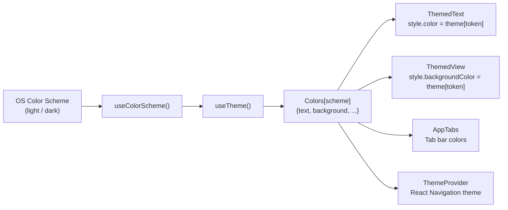
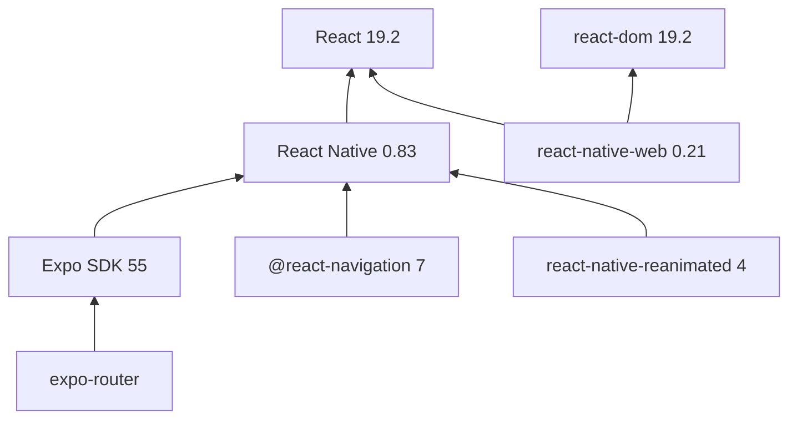
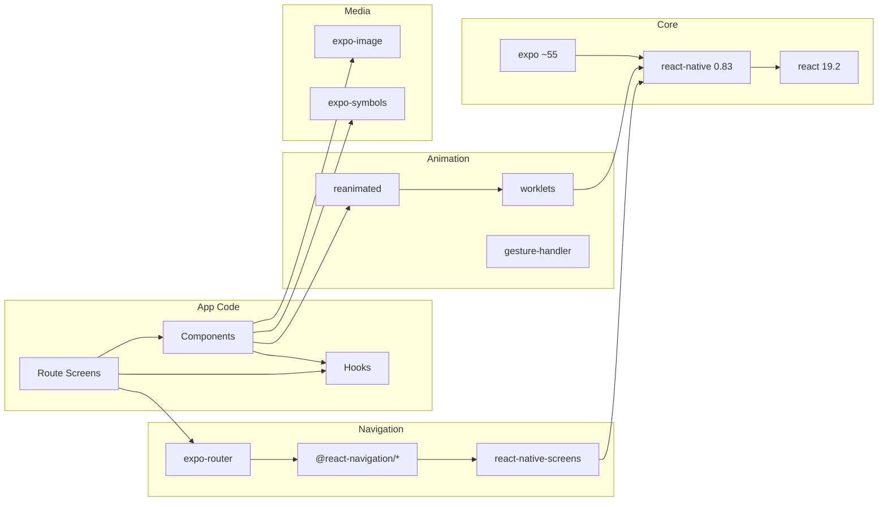

# spot — Architecture Documentation

## 1. Project Structure

### Directory Layout

```
spot/
├── app.json                  # Expo app configuration (name, plugins, experiments)
├── package.json              # Dependencies, scripts, metadata
├── tsconfig.json             # TypeScript strict config + path aliases
├── pnpm-workspace.yaml       # pnpm nodeLinker: hoisted
├── pnpm-lock.yaml            # Deterministic lockfile
├── expo-env.d.ts             # Auto-generated Expo type declarations
├── assets/
│   ├── expo.icon/            # Adaptive iOS icon (expo-image format)
│   │   └── icon.json + Assets/
│   └── images/
│       ├── android-icon-*.png    # Android adaptive icon layers
│       ├── expo-logo.png         # Main logo image
│       ├── logo-glow.png         # Animated glow overlay
│       ├── expo-badge*.png       # Light/dark web badges
│       ├── react-logo*.png       # React logo (@1x, @2x, @3x)
│       ├── splash-icon.png       # Splash screen icon
│       ├── tutorial-web.png      # Tutorial screenshot
│       ├── icon.png / favicon.png
│       └── tabIcons/             # Tab bar icon assets
├── scripts/
│   └── reset-project.js     # Resets starter code to blank app
├── src/                      # Application source root
│   ├── app/                  # Route screens (expo-router)
│   ├── components/           # Shared UI components
│   ├── constants/            # Design tokens & config
│   ├── hooks/                # Custom React hooks
│   ├── types/                # Shared TypeScript types (empty)
│   └── global.css            # Web font-face CSS variables
├── docs/                     # Documentation
│   ├── agent-first-guide.md  # Agent-first development guide
│   └── memory/               # Durable project memory (layered)
│       ├── PROJECT_CONTEXT.md
│       ├── ARCHITECTURE.md
│       ├── DECISIONS.md
│       ├── BUGS.md
│       └── WORKLOG.md
├── specs/                    # Active feature delivery artifacts
│   └── README.md             # Spec folder conventions guide
├── .specify/                 # Spec Kit SDD workflow
├── .agents/                  # Copilot agent skills
├── .github/                  # CI/CD, prompts, repo index
├── test/                     # Test directory (empty)
└── test-results/             # Test output directory (empty)
```

### Module Organization

The app uses a **flat module structure** — there are no nested packages or workspaces beyond the root. All source code lives under `src/` and is organized by **concern**:

| Directory | Purpose |
|-----------|---------|
| `src/app/` | Route screens. Each file maps to a URL path via expo-router. |
| `src/components/` | Reusable UI components shared across screens. |
| `src/components/ui/` | Generic UI primitives (e.g., `Collapsible`). |
| `src/constants/` | Design tokens and configuration constants. |
| `src/hooks/` | Custom React hooks for theme and color scheme. |
| `src/types/` | Shared TypeScript type definitions (currently empty). |
| `docs/memory/` | Durable project memory: product context, architecture, decisions, bugs, worklog. |
| `specs/` | Active feature specs with per-feature memory and synthesis files. |

### Package Structure

The project uses **TypeScript path aliases** for clean imports:

- `@/*` → `./src/*`
- `@/assets/*` → `./assets/*`

All imports use these aliases rather than relative paths across boundaries. Within the same directory, relative imports are used (e.g., `./themed-text` inside `components/`).

### Build Configuration

| Aspect | Configuration |
|--------|---------------|
| **Entry point** | `expo-router/entry` (declared in `package.json#main`) |
| **Bundler** | Metro (via Expo CLI) |
| **TypeScript** | Strict mode, extends `expo/tsconfig.base` |
| **React Compiler** | Enabled (`experiments.reactCompiler: true`) |
| **Typed Routes** | Enabled (`experiments.typedRoutes: true`) |
| **Web output** | Static (`web.output: "static"` in app.json) |
| **Plugins** | `expo-router`, `expo-splash-screen`, `expo-image` |

## 2. Core Components

### Application Entry Point

The app entry is `expo-router/entry` which bootstraps the file-based router. The router scans `src/app/` for route files.

**Root Layout** — [src/app/_layout.tsx](src/app/_layout.tsx):
```typescript
export default function TabLayout() {
  const colorScheme = useColorScheme();
  return (
    <ThemeProvider value={colorScheme === 'dark' ? DarkTheme : DefaultTheme}>
      <AnimatedSplashOverlay />
      <AppTabs />
    </ThemeProvider>
  );
}
```

Wraps the entire app in `@react-navigation/native`'s `ThemeProvider` and renders the splash overlay animation followed by the tab navigator.

### Controllers / Route Screens

| Screen | File | Description |
|--------|------|-------------|
| **Home** | [src/app/index.tsx](src/app/index.tsx) | Hero section with animated Expo icon, welcome title, and getting-started hints. Detects device type via `expo-device` to show platform-specific devtools instructions. |
| **Explore** | [src/app/explore.tsx](src/app/explore.tsx) | Scrollable documentation page with collapsible sections covering routing, platform support, images, theming, and animations. Links to Expo docs. |

### Navigation — Tab Bar

The tab bar is **platform-split** into two entirely different implementations:

**Native** — [src/components/app-tabs.tsx](src/components/app-tabs.tsx):
- Uses `NativeTabs` from `expo-router/unstable-native-tabs`
- Configures `backgroundColor`, `indicatorColor`, `labelStyle` from theme colors
- Declares two triggers: `index` (Home) and `explore` (Explore) with PNG tab icons

**Web** — [src/components/app-tabs.web.tsx](src/components/app-tabs.web.tsx):
- Uses `Tabs`, `TabList`, `TabTrigger`, `TabSlot` from `expo-router/ui`
- Custom `TabButton` component with pressed/focused states
- Custom `CustomTabList` with brand text ("Expo Starter") and external Docs link
- Positioned as a floating pill-shaped bar at the top

### Service Layer (Design System)

There is no traditional business logic layer — this is a UI-first starter app. The "service layer" is the **design system**:

**Theme Tokens** — [src/constants/theme.ts](src/constants/theme.ts):
- `Colors`: Light/dark palettes (`text`, `background`, `backgroundElement`, `backgroundSelected`, `textSecondary`)
- `Fonts`: Per-platform font family maps (`sans`, `serif`, `rounded`, `mono`)
- `Spacing`: 7-step scale (2, 4, 8, 16, 24, 32, 64)
- `BottomTabInset`: Platform-specific bottom inset (iOS: 50, Android: 80, Web: 0)
- `MaxContentWidth`: 800px content constraint

### Data Access Layer

No data persistence, API calls, or database access exist. The app is entirely static/presentational.

### Models / Entities

**`ThemeColor`** — Union type of color token keys (`text | background | backgroundElement | backgroundSelected | textSecondary`), derived from the `Colors` object.

**`ThemedTextProps`** — Extends `TextProps` with `type` (typography variant) and `themeColor` (color override).

**`ThemedViewProps`** — Extends `ViewProps` with `type` (background color token), `lightColor`, and `darkColor`.

### Configuration

| File | Purpose |
|------|---------|
| `app.json` | Expo app metadata, icons, splash screen, plugins, experiments |
| `tsconfig.json` | TypeScript strict mode, path aliases |
| `pnpm-workspace.yaml` | Package manager config (`nodeLinker: hoisted`) |
| `src/global.css` | Web CSS custom properties for font families |
| `.github/copilot-instructions.md` | AI agent context: build commands, architecture, conventions, memory workflow |
| `.specify/memory/constitution.md` | Project constitution (principles and governance) |
| `docs/memory/*.md` | Durable project memory (context, architecture, decisions, bugs, worklog) |

## 3. Architecture Overview

### Architectural Style

The app follows a **Layered Presentation Architecture** with three tiers:

1. **Navigation Layer** — expo-router file-based routing + platform-split tab bars
2. **Component Layer** — Themed UI primitives and screen-level compositions
3. **Token Layer** — Design tokens providing colors, fonts, spacing, and layout constants

There is no data layer, API layer, or state management beyond React component state. The architecture is purely **view-centric**.

### Component Diagram

```mermaid
graph TB
    subgraph NavigationLayer["Navigation Layer"]
        ExpoRouter["expo-router/entry"]
        Layout["_layout.tsx<br/>ThemeProvider"]
        NativeTabs["app-tabs.tsx<br/>NativeTabs (iOS/Android)"]
        WebTabs["app-tabs.web.tsx<br/>Custom TabBar (Web)"]
    end

    subgraph ScreenLayer["Screen Layer"]
        Home["index.tsx<br/>Home Screen"]
        Explore["explore.tsx<br/>Explore Screen"]
    end

    subgraph ComponentLayer["Component Layer"]
        ThemedText["ThemedText<br/>8 type variants"]
        ThemedView["ThemedView<br/>Token-based bg"]
        AnimatedIcon["AnimatedIcon<br/>Logo + glow animation"]
        SplashOverlay["AnimatedSplashOverlay<br/>Scale-down fade-out"]
        HintRow["HintRow<br/>Label + code hint"]
        Collapsible["Collapsible<br/>Expand/collapse + FadeIn"]
        ExternalLink["ExternalLink<br/>In-app browser"]
        WebBadge["WebBadge<br/>Version + badge"]
    end

    subgraph TokenLayer["Token / Hook Layer"]
        ThemeTS["theme.ts<br/>Colors · Fonts · Spacing"]
        UseTheme["useTheme()"]
        UseColorScheme["useColorScheme()"]
        GlobalCSS["global.css<br/>CSS custom props"]
    end

    subgraph ExternalDeps["External Libraries"]
        Reanimated["react-native-reanimated"]
        Worklets["react-native-worklets"]
        ExpoImage["expo-image"]
        ExpoSymbols["expo-symbols"]
        ExpoDevice["expo-device"]
        ExpoWebBrowser["expo-web-browser"]
    end

    ExpoRouter --> Layout
    Layout --> SplashOverlay
    Layout --> NativeTabs
    Layout --> WebTabs
    NativeTabs --> Home & Explore
    WebTabs --> Home & Explore

    Home --> ThemedText & ThemedView & AnimatedIcon & HintRow & WebBadge
    Explore --> ThemedText & ThemedView & Collapsible & ExternalLink & WebBadge

    ThemedText --> UseTheme
    ThemedView --> UseTheme
    Collapsible --> UseTheme & Reanimated
    AnimatedIcon --> Reanimated & ExpoImage
    SplashOverlay --> Reanimated & Worklets
    ExternalLink --> ExpoWebBrowser
    WebBadge --> ExpoImage
    Home --> ExpoDevice

    UseTheme --> UseColorScheme & ThemeTS
end
```

### Data Flow



Data flow is **unidirectional** and **read-only**: OS reports color scheme → hooks resolve active palette → components consume token values. No user-generated data, mutations, or side effects exist.

### Communication Patterns

- **Props down**: All component configuration flows via React props
- **Context**: `ThemeProvider` from `@react-navigation/native` distributes navigation theme
- **Hooks**: `useTheme()` and `useColorScheme()` provide theme data without context (reading directly from `Colors` constant)
- **No event bus, no pub/sub, no global state management**

### Design Patterns

| Pattern | Usage |
|---------|-------|
| **Platform file splitting** | `.web.tsx` / `.web.ts` suffix convention for Metro/webpack resolution |
| **Composition** | Screens compose `ThemedText`, `ThemedView`, `HintRow`, `Collapsible` |
| **Render prop / `asChild`** | `TabTrigger asChild`, `ExternalLink asChild` delegate rendering to children |
| **Token-based theming** | Centralized `Colors`, `Fonts`, `Spacing` objects consumed via hooks |
| **Keyframe animations** | Declarative animation definitions with `react-native-reanimated` `Keyframe` API |
| **Worklet scheduling** | `scheduleOnRN()` bridges worklet thread back to JS for `setState` |

## 4. Detailed Component Analysis

### ThemedText

- **Purpose**: Theme-aware replacement for React Native `Text`
- **Responsibilities**: Applies color from active theme, supports 8 typography variants
- **Dependencies**: `useTheme()`, `Fonts` from theme.ts
- **Interface**: `type` prop selects variant (`default`, `title`, `small`, `smallBold`, `subtitle`, `link`, `linkPrimary`, `code`); `themeColor` overrides color token
- **Key file**: [src/components/themed-text.tsx](src/components/themed-text.tsx)

### ThemedView

- **Purpose**: Theme-aware replacement for React Native `View`
- **Responsibilities**: Applies background color from active theme token
- **Dependencies**: `useTheme()`
- **Interface**: `type` prop selects background token (defaults to `background`)
- **Key file**: [src/components/themed-view.tsx](src/components/themed-view.tsx)

### AnimatedIcon / AnimatedSplashOverlay

- **Purpose**: Animated Expo logo with glow effect + full-screen splash-to-icon transition
- **Responsibilities**: Splash overlay scales down and fades out on app launch; icon renders logo with rotating glow
- **Dependencies**: `react-native-reanimated` (Keyframe), `react-native-worklets` (scheduleOnRN), `expo-image`
- **Platform split**:
  - **Native**: Solid-color background view scales down; worklet callback unmounts overlay via `scheduleOnRN`
  - **Web**: `AnimatedSplashOverlay` returns `null` (no splash on web); icon uses CSS module for gradient background
- **Key files**: [src/components/animated-icon.tsx](src/components/animated-icon.tsx), [src/components/animated-icon.web.tsx](src/components/animated-icon.web.tsx)

### AppTabs (Navigation)

- **Purpose**: Bottom tab bar navigating between Home and Explore
- **Platform split**:
  - **Native**: `NativeTabs` from `expo-router/unstable-native-tabs` — declarative trigger-based API with PNG icons
  - **Web**: Custom floating pill tab bar using `Tabs`/`TabList`/`TabTrigger`/`TabSlot` from `expo-router/ui`, includes brand text and external docs link
- **Dependencies**: `expo-router`, `expo-symbols` (web), `Colors` theme tokens
- **Key files**: [src/components/app-tabs.tsx](src/components/app-tabs.tsx), [src/components/app-tabs.web.tsx](src/components/app-tabs.web.tsx)

### Collapsible

- **Purpose**: Animated expand/collapse section with chevron indicator
- **Responsibilities**: Toggle visibility with `FadeIn` animation; render chevron icon via `expo-symbols`
- **Dependencies**: `react-native-reanimated` (FadeIn), `expo-symbols` (SymbolView), `useTheme()`
- **Key file**: [src/components/ui/collapsible.tsx](src/components/ui/collapsible.tsx)

### ExternalLink

- **Purpose**: Opens URLs in the system browser (web) or in-app browser (native)
- **Responsibilities**: Intercepts press on native to open `expo-web-browser`; passes through on web
- **Dependencies**: `expo-router` (Link), `expo-web-browser`
- **Key file**: [src/components/external-link.tsx](src/components/external-link.tsx)

### useTheme / useColorScheme

- **Purpose**: Resolve active color palette from device color scheme
- **useTheme()**: Returns `Colors.light` or `Colors.dark` based on scheme
- **useColorScheme()**: Platform-split hook
  - **Native**: Re-exports `useColorScheme` from `react-native`
  - **Web**: Adds hydration guard — returns `'light'` before client hydration to avoid SSR mismatch
- **Key files**: [src/hooks/use-theme.ts](src/hooks/use-theme.ts), [src/hooks/use-color-scheme.ts](src/hooks/use-color-scheme.ts), [src/hooks/use-color-scheme.web.ts](src/hooks/use-color-scheme.web.ts)

## 5. Dependency Analysis

### Direct Dependencies

| Package | Version | Category |
|---------|---------|----------|
| `expo` | ~55.0.17 | Core framework |
| `expo-router` | ~55.0.13 | File-based routing |
| `react` | 19.2.0 | UI library |
| `react-native` | 0.83.6 | Native runtime |
| `react-dom` | 19.2.0 | Web rendering |
| `react-native-web` | ~0.21.0 | Web compatibility layer |
| `@react-navigation/native` | ^7.1.33 | Navigation core |
| `@react-navigation/bottom-tabs` | ^7.15.5 | Tab navigation |
| `@react-navigation/elements` | ^2.9.10 | Navigation UI elements |
| `react-native-reanimated` | 4.2.1 | Animation library |
| `react-native-worklets` | 0.7.4 | Worklet scheduler |
| `react-native-gesture-handler` | ~2.30.0 | Gesture system |
| `react-native-screens` | ~4.23.0 | Native screen optimization |
| `react-native-safe-area-context` | ~5.6.2 | Safe area insets |
| `expo-image` | ~55.0.9 | Optimized image component |
| `expo-symbols` | ~55.0.7 | SF Symbols / Material icons |
| `expo-device` | ~55.0.15 | Device info |
| `expo-font` | ~55.0.6 | Custom font loading |
| `expo-constants` | ~55.0.15 | App constants |
| `expo-splash-screen` | ~55.0.19 | Splash screen control |
| `expo-status-bar` | ~55.0.5 | Status bar styling |
| `expo-system-ui` | ~55.0.16 | System UI config |
| `expo-linking` | ~55.0.14 | Deep linking |
| `expo-web-browser` | ~55.0.14 | In-app browser |
| `expo-glass-effect` | ~55.0.10 | Glass blur effect |

### Dev Dependencies

| Package | Version | Category |
|---------|---------|----------|
| `@types/react` | ~19.2.2 | TypeScript types |
| `typescript` | ~5.9.2 | Compiler |

### Framework Stack



### Dependency Categories

**Core Runtime**: `expo`, `react`, `react-native`, `react-dom`, `react-native-web`

**Navigation**: `expo-router`, `@react-navigation/native`, `@react-navigation/bottom-tabs`, `@react-navigation/elements`, `react-native-screens`

**Animation & Gesture**: `react-native-reanimated`, `react-native-worklets`, `react-native-gesture-handler`

**UI & Media**: `expo-image`, `expo-symbols`, `expo-font`, `expo-glass-effect`

**Platform Services**: `expo-device`, `expo-constants`, `expo-status-bar`, `expo-system-ui`, `expo-splash-screen`, `expo-linking`, `expo-web-browser`

**Layout**: `react-native-safe-area-context`

**Testing**: None configured

### Dependency Graph (Key Relationships)



### Version Compatibility Notes

- All `expo-*` packages are pinned to SDK 55 compatible ranges (`~55.0.x`).
- `react-native-reanimated` 4.x requires `react-native-worklets` as a peer dependency — both are correctly installed.
- `react` 19.2 and `react-native` 0.83 are the latest major versions; no legacy compatibility concerns.
- `expo-router/unstable-native-tabs` is an **unstable** API — may change in future Expo SDK releases.
- No deprecated or known-vulnerable packages detected at time of analysis.

## 6. Performance Considerations

### Rendering Performance

- **React Compiler enabled**: Automatic memoization eliminates manual `useMemo`/`useCallback` for most cases. This is a significant optimization for re-render prevention.
- **No unnecessary re-renders from theme**: `useTheme()` reads from a static `Colors` constant — it only triggers re-render when the OS color scheme changes (rare event).
- **`expo-image` over `Image`**: `expo-image` provides disk/memory caching, progressive loading, and better performance than the built-in `Image` component.

### Animation Performance

- **Worklet-based animations**: All animations use `react-native-reanimated` Keyframe API which runs on the UI thread, avoiding JS thread blocking.
- **`scheduleOnRN` for state updates**: The splash overlay uses `scheduleOnRN(setVisible, false)` to safely bridge from the worklet thread back to JS, avoiding race conditions.
- **Long-running glow animation**: The `AnimatedIcon` glow rotates for `60 * 1000 * 4` ms (4 minutes). Since it runs on the UI thread via reanimated, this has negligible JS thread impact.

### Web-Specific Optimizations

- **Static output**: `web.output: "static"` in app.json enables static site generation.
- **SSR hydration guard**: `useColorScheme.web.ts` returns `'light'` before hydration to prevent flash-of-unstyled-content.
- **CSS module for gradient**: Web uses a CSS module (`.animated-icon.module.css`) for the logo background gradient instead of inline styles, enabling browser CSS optimizations.
- **No splash overlay on web**: `AnimatedSplashOverlay` returns `null` on web, avoiding unnecessary DOM nodes.

### Bundle Size

- **No heavy utility libraries**: No lodash, moment, or similar large libraries.
- **Platform splitting**: `.web.tsx` variants ensure native-only code isn't bundled for web and vice versa.
- **Tree-shaking potential**: Expo SDK 55 + Metro supports tree-shaking for ESM imports.

### Scalability Analysis

- **Horizontal scaling**: As a client-side app with no backend, scaling is handled by app stores (native) and CDN (web static output).
- **Screen/route scaling**: expo-router's file-based routing means adding screens requires only adding files — no central router config to manage.
- **Component scaling**: The token-based design system (`ThemedText`, `ThemedView`, `Spacing`) scales well for additional components.

### Performance Recommendations

1. **Add lazy loading for routes**: As more screens are added, use `React.lazy()` or expo-router's lazy loading to code-split.
2. **Memoize heavy Keyframe objects**: Keyframe definitions are currently created inline at module scope — this is fine, but if moved into components, they should be memoized.
3. **Consider expo-font preloading**: `expo-font` is listed as a dependency but no custom fonts are loaded explicitly — web relies on CSS `@font-face` only.

## 7. Technical Debt & Recommendations

### Identified Issues

| Issue | Severity | Description |
|-------|----------|-------------|
| **No tests** | Medium | `test/` and `test-results/` directories exist but are empty. No test framework configured. |
| **Unstable API usage** | Low | `expo-router/unstable-native-tabs` is an unstable API that may break on SDK upgrades. |
| **Empty types directory** | Low | `src/types/` is empty — consider removing or populating with shared types. |
| **Unused dependencies** | Low | `expo-glass-effect`, `expo-font`, `expo-constants`, `expo-status-bar`, `expo-linking` are declared but not imported in any source file. |
| **Template-only memory** | Low | `docs/memory/DECISIONS.md`, `BUGS.md`, and `WORKLOG.md` contain only template placeholders. `PROJECT_CONTEXT.md` and `ARCHITECTURE.md` are now populated. |
| **No ESLint config** | Low | Linting available via `npx expo lint` but no `.eslintrc` or ESLint config present. |

### Improvement Opportunities

1. **Configure testing**: Add Jest + React Native Testing Library. The `test/` directory is ready.
2. **Audit unused dependencies**: Remove `expo-glass-effect` and other unused packages to reduce install size.
3. **Fill durable memory**: Populate `docs/memory/PROJECT_CONTEXT.md` and `ARCHITECTURE.md` with project-specific content.
4. **Add ESLint configuration**: Run `npx expo lint` once to generate the config, then commit it.
5. **Add error boundaries**: No error boundary exists — a crash in any component will unmount the entire app.

### Best Practice Alignment

| Practice | Status |
|----------|--------|
| TypeScript strict mode | ✅ Enabled |
| Consistent theming | ✅ Token-based via ThemedText/ThemedView |
| Platform-specific code | ✅ File suffix convention |
| Path aliases | ✅ `@/*` configured |
| React Compiler | ✅ Enabled |
| Constitution | ✅ Ratified v1.0.0 (5 principles) |
| Testing | ❌ Not configured |
| Error boundaries | ❌ Not present |
| Linting | ⚠️ Available but no config committed |
| Durable memory | ⚠️ PROJECT_CONTEXT + ARCHITECTURE populated; DECISIONS/BUGS/WORKLOG still template |
| CI/CD | ❌ Not configured |

---

**Generated**: April 25, 2026 (refreshed) | **Spec Kit Extension**: repoindex v1.0.0
