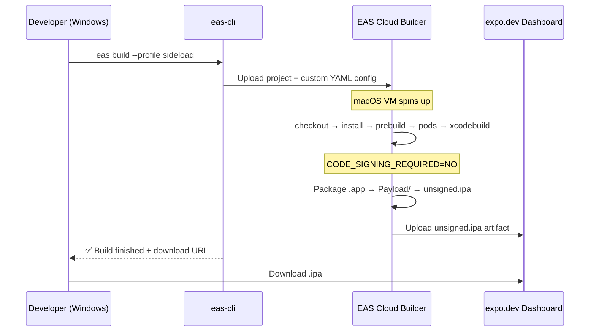
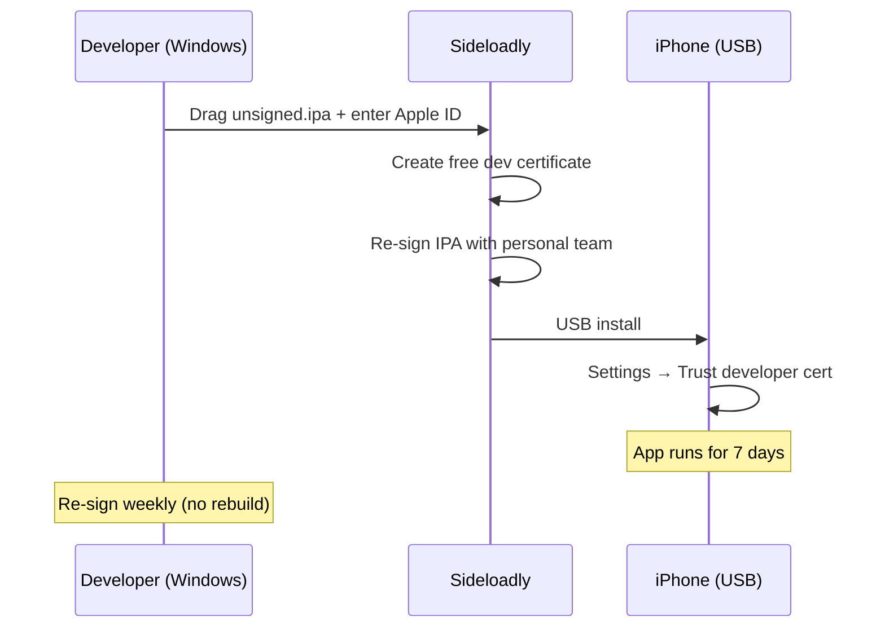

# Module: EAS Build Unsigned IPA for Sideloading

## Business Context

### Module Purpose

Enable a developer on **Windows** (no Mac) to build an iOS `.ipa` for physical iPhone testing using only **free accounts** (free Expo/EAS + free Apple ID). The unsigned IPA is built in the cloud via EAS Build using a custom YAML workflow that bypasses all Apple credential requirements, then re-signed locally with Sideloadly/AltStore and installed on device via USB.

### Business Scenarios

- Solo developer on Windows iterating on an Expo React Native app needs to test on a real iPhone
- Zero-cost iOS device testing without $99/yr Apple Developer Program
- Standalone app testing (not Expo Go sandbox) for native module compatibility

### Use Cases

1. **Build unsigned IPA**: `npx eas build --platform ios --profile sideload` → downloads `.ipa` from expo.dev
2. **Re-sign and install**: Sideloadly on Windows → drag `.ipa` → enter free Apple ID → USB install
3. **Weekly re-sign**: Same `.ipa` in Sideloadly every 7 days (no rebuild needed)
4. **Simulator build**: `npx eas build --platform ios --profile development` → `.app` for iOS Simulator (Mac required to run)

### Domain Concepts

- **Unsigned IPA**: iOS application archive built with `CODE_SIGNING_REQUIRED=NO` — cannot be installed directly, must be re-signed
- **Custom Build YAML**: EAS Build workflow file (`.eas/build/*.yml`) that replaces the standard build pipeline with explicit steps
- **Sideloading**: Installing an app on iOS outside the App Store, using tools like Sideloadly or AltStore
- **Free Apple ID Personal Team**: Apple's free development signing tier — 7-day cert, 3 app limit, no capabilities

## Technical Overview

### Module Type

Configuration + Cloud Build Workflow + Documentation (no application code)

### Key Technologies

- **Build Service**: EAS Build (Expo Application Services) — cloud iOS/Android builder
- **Build Tool**: `xcodebuild` (invoked via custom YAML on EAS cloud macOS VM)
- **CLI**: `eas-cli` v18.8.1+
- **Re-signing**: Sideloadly (Windows) or AltStore/AltServer
- **Config Format**: JSON (eas.json, app.json) + YAML (custom build workflow)

### Module Structure

```
.eas/
└── build/
    └── unsigned-ios.yml         # Custom build workflow (the core of this module)

eas.json                         # Build profiles: development, sideload, production
app.json                         # ios.bundleIdentifier: com.izkizk8.spot
docs/
└── eas-build-guide.md           # Complete sideloading guide
.github/
└── copilot-instructions.md      # Build & Run section (updated)

specs/004-eas-build-ipa/
├── spec.md                      # Feature specification
├── plan.md                      # Implementation plan
├── tasks.md                     # 17/17 tasks complete
├── research.md                  # 5 findings + 7 build attempts documented
└── quickstart.md                # Verification commands
```

## Components

### Custom Build Workflow (Core)

**File**: `.eas/build/unsigned-ios.yml`

The heart of the module. Replaces the standard EAS iOS build pipeline with 8 explicit steps:

| Step | Function | Purpose |
|------|----------|---------|
| 1 | `eas/checkout` | Check out source code |
| 2 | `eas/install_node_modules` | Install pnpm dependencies |
| 3 | `eas/resolve_build_config` | Resolve EAS config |
| 4 | `eas/prebuild` | Generate native `ios/` directory from managed project |
| 5 | `pod install` | Install CocoaPods dependencies |
| 6 | `xcodebuild` | Build with `CODE_SIGNING_REQUIRED=NO -sdk iphoneos` |
| 7 | Package IPA | `.app` → `Payload/` → zip as `unsigned.ipa` |
| 8 | `eas/upload_artifact` | Upload IPA to EAS dashboard |

**Key exclusions** (steps deliberately NOT included):
- `eas/configure_ios_credentials` — no Apple credentials needed
- `eas/configure_eas_update` — expo-updates not installed
- `eas/generate_gymfile_from_template` — using xcodebuild directly
- `eas/run_fastlane` — using xcodebuild directly

### Build Profiles Configuration

**File**: `eas.json`

| Profile | Purpose | Credentials | Output |
|---------|---------|-------------|--------|
| `development` | iOS Simulator | None | `.app` (.tar.gz) |
| `sideload` | Physical device | None (custom YAML) | `.ipa` (unsigned) |
| `production` | App Store | Paid Apple Developer | `.ipa` (signed) |

### App Configuration

**File**: `app.json`

- `ios.bundleIdentifier`: `com.izkizk8.spot`
- `ios.infoPlist.ITSAppUsesNonExemptEncryption`: `false`

### Documentation

**File**: `docs/eas-build-guide.md`

Complete guide covering: TL;DR table, build command, download IPA, Sideloadly re-sign workflow, AltStore alternative, free Apple ID limitations, troubleshooting, quick reference.

## Workflow

### Build Flow



### Sideload Flow



## Dependencies

### External Services

| Service | Type | Required | Cost |
|---------|------|----------|------|
| EAS Build | Cloud build | Yes | Free (15 builds/month) |
| expo.dev | Dashboard | Yes | Free |
| Apple (Sideloadly) | Re-signing | Yes | Free Apple ID |

### Tools (Developer Machine)

| Tool | Platform | Purpose |
|------|----------|---------|
| `eas-cli` | Windows/Mac/Linux | Trigger builds |
| Sideloadly | Windows/Mac | Re-sign + USB install |
| iTunes for Windows | Windows | USB communication |
| AltStore/AltServer | Windows/Mac | Alternative: auto-renew over Wi-Fi |

### Project Dependencies

- Expo SDK 55 (managed workflow)
- No `expo-updates` (excluded from custom YAML)
- No custom native modules (managed prebuild only)

## Quality Observations

### Strengths

- **Zero cost**: Free EAS + free Apple ID — no $99/yr Apple Developer
- **No Mac required**: Everything runs on Windows + EAS cloud
- **Reusable IPA**: Same `.ipa` can be re-signed weekly without rebuilding
- **Custom YAML is portable**: Can be adapted for any Expo project
- **Well-documented**: 7 build attempts with root cause analysis for each failure

### Concerns

- **7-day certificate expiry**: Requires weekly re-signing (Sideloadly manual, AltStore auto)
- **3 app limit**: Free Apple ID can only have 3 sideloaded apps simultaneously
- **No capabilities**: Push notifications, iCloud, Sign in with Apple etc. won't work
- **Build quota**: 15 free builds/month — sufficient but limited
- **Scheme detection**: Uses Python fallback for workspace vs project — fragile if project structure changes

### Lessons Learned (from 7 build attempts)

1. `withoutCredentials: true` alone does NOT work — custom YAML is required
2. `distribution: "internal"` requires paid Apple Developer — do not use
3. Do NOT include `eas/configure_eas_update` if expo-updates is not installed
4. `xcodebuild -list -json` returns `project` key (not `workspace`) — must handle both
5. Custom builds DO work on free EAS plan (previous failures were YAML format issues)
6. The standard EAS pipeline's Step 7 (`Restore credentials`) is hardcoded — cannot be skipped without custom YAML
7. Workspace name must be explicit (`spot.xcworkspace`), not glob (`*.xcworkspace`)

## Build History

| Build ID | Date | Approach | Result |
|----------|------|----------|--------|
| 50cc8ed9 | 2026-04-25 | `simulator: true` | ✅ Simulator .app |
| (4 attempts) | 2026-04-25 | `withoutCredentials` only | ❌ PREPARE_CREDENTIALS crash |
| 40ad5d9e | 2026-04-25 | Custom YAML v1 | ❌ `eas/configure_eas_update` not installed |
| cd1b1ab2 | 2026-04-25 | Custom YAML v2 | ❌ `KeyError: 'workspace'` |
| **cdb774a4** | **2026-04-25** | **Custom YAML v3** | **✅ Unsigned IPA SUCCESS** |

**Successful IPA**: https://expo.dev/artifacts/eas/rpmUqmvTf8qwjyi8dWSzKi.ipa

---

**Generated**: 2026-04-25
**Module Path**: `.eas/build/` + `eas.json` + `docs/eas-build-guide.md`
**Feature Branch**: `004-eas-build-ipa`
