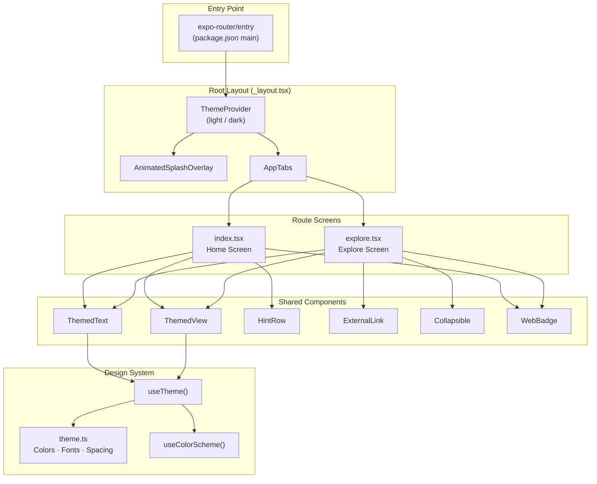

# spot

## Introduction

**spot** is a cross-platform mobile and web application built with **Expo SDK 55** and **React Native 0.83**. It targets iOS, Android, and the web from a single TypeScript codebase using file-based routing via `expo-router`. The project is in its early starter-app phase and ships two screens — a **Home** landing page with an animated Expo logo and a **Getting Started** hint panel, and an **Explore** page with collapsible documentation links.

The repository follows an **agent-first development workflow** with Spec Kit (`.specify/`) for Specification-Driven Development and a set of Copilot skills for TDD, debugging, and code review.

## Project Architecture

### Technology Stack

| Layer | Technology |
|-------|-----------|
| **Language** | TypeScript 5.9 (strict mode) |
| **UI Framework** | React 19.2 / React Native 0.83 |
| **App Framework** | Expo SDK 55 (`expo-router` with typed routes) |
| **Animations** | `react-native-reanimated` 4.2 + `react-native-worklets` 0.7 |
| **Navigation** | `@react-navigation/native` 7 / `@react-navigation/bottom-tabs` 7 |
| **Images** | `expo-image` |
| **Package Manager** | pnpm (nodeLinker: hoisted) |
| **Compiler** | React Compiler enabled (`experiments.reactCompiler: true`) |
| **Build Tool** | Expo CLI / Metro bundler |

### Source Layout

```
src/
├── app/                  # Route screens (file-based routing)
│   ├── _layout.tsx       # Root layout — ThemeProvider + tab navigator
│   ├── index.tsx         # Home screen
│   └── explore.tsx       # Explore screen
├── components/           # Shared UI components
│   ├── animated-icon.tsx / .web.tsx   # Animated Expo logo (platform-split)
│   ├── app-tabs.tsx      / .web.tsx   # Tab navigation (platform-split)
│   ├── external-link.tsx              # In-app browser link wrapper
│   ├── hint-row.tsx                   # Key-value hint row
│   ├── themed-text.tsx                # Theme-aware Text wrapper
│   ├── themed-view.tsx                # Theme-aware View wrapper
│   ├── web-badge.tsx                  # Expo version badge (web only)
│   └── ui/
│       └── collapsible.tsx            # Animated collapsible section
├── constants/
│   └── theme.ts          # Design tokens: Colors, Fonts, Spacing, layout constants
├── hooks/
│   ├── use-color-scheme.ts / .web.ts  # Color scheme hook (platform-split)
│   └── use-theme.ts                   # Returns active light/dark color set
├── types/                # Shared TypeScript types
└── global.css            # Web font-face declarations
```

### Architecture Diagram



### Key Components

| Component | Purpose |
|-----------|---------|
| **`_layout.tsx`** | Root layout wrapping the app in `ThemeProvider` and rendering `AnimatedSplashOverlay` + `AppTabs`. |
| **`AppTabs`** | Platform-split tab navigator. Native uses `NativeTabs` from `expo-router/unstable-native-tabs`; web uses a custom tab bar built with `Tabs`/`TabList`/`TabTrigger`/`TabSlot` from `expo-router/ui`. |
| **`AnimatedSplashOverlay`** | Full-screen splash that scales down and fades out via `react-native-reanimated` Keyframe animations, then unmounts. |
| **`ThemedText` / `ThemedView`** | Theme-aware wrappers around `Text` and `View` that apply colors from the `Colors` token set via `useTheme()`. |
| **`useTheme()`** | Hook returning the active `Colors.light` or `Colors.dark` object based on the device color scheme. |
| **`useColorScheme()`** | Platform-split hook. Native re-exports RN's hook directly; web adds a hydration guard for SSR/static rendering. |
| **`Collapsible`** | Animated expand/collapse section using `FadeIn` from reanimated. |
| **`ExternalLink`** | Wraps `expo-router` `Link`; on native opens links in an in-app browser via `expo-web-browser`. |

### Platform-Specific Strategy

The project uses the **`.web.tsx` / `.web.ts` suffix convention** — Metro/webpack automatically resolve the web variant when bundling for the web platform:

| File Pair | Native | Web |
|-----------|--------|-----|
| `animated-icon` | Reanimated Keyframe + expo-image | CSS module animation |
| `app-tabs` | `NativeTabs` (expo-router) | Custom `Tabs`/`TabList` (expo-router/ui) |
| `use-color-scheme` | RN `useColorScheme` re-export | Hydration-safe wrapper |

### Theming & Design Tokens

Defined in `src/constants/theme.ts`:

- **Colors**: Light/dark palettes with `text`, `background`, `backgroundElement`, `backgroundSelected`, `textSecondary`.
- **Fonts**: Per-platform font families (`sans`, `serif`, `rounded`, `mono`); web uses CSS custom properties from `global.css`.
- **Spacing scale**: `half` (2) → `one` (4) → `two` (8) → `three` (16) → `four` (24) → `five` (32) → `six` (64).
- **Layout constants**: `MaxContentWidth` (800px), `BottomTabInset` (iOS: 50, Android: 80).

## Getting Started

### Prerequisites

| Tool | Version |
|------|---------|
| **Node.js** | 18+ (LTS recommended) |
| **pnpm** | 8+ |
| **Expo CLI** | Bundled via `npx expo` |
| **iOS Simulator** | Xcode 15+ (macOS only) |
| **Android Emulator** | Android Studio / SDK 34+ |

### Configuration

- **`app.json`** — Expo configuration: app name, slug, icons, splash screen, plugins, experiments.
- **`tsconfig.json`** — TypeScript strict mode, path aliases (`@/*` → `./src/*`, `@/assets/*` → `./assets/*`).
- **`pnpm-workspace.yaml`** — `nodeLinker: hoisted` for Expo/RN compatibility.

No `.env` files or secrets are required for local development.

### Local Development Setup

```bash
# 1. Clone the repository
git clone <repo-url> spot && cd spot

# 2. Install dependencies
pnpm install

# 3. Start the development server
npx expo start
```

### Running the Application

| Command | Description |
|---------|-------------|
| `pnpm start` / `npx expo start` | Start Expo dev server (all platforms) |
| `npx expo start --ios` | Launch on iOS Simulator |
| `npx expo start --android` | Launch on Android Emulator |
| `npx expo start --web` | Launch in browser |
| `npx expo lint` | Run linter |
| `npm run reset-project` | Move starter code to `app-example/` and create blank `app/` |

### Project Tooling

| Tool | Purpose |
|------|---------|
| **Spec Kit** (`.specify/`) | Specification-Driven Development workflow |
| **Copilot Skills** (`.agents/`) | Agent-first development: TDD, debugging, code review |
| **Typed Routes** | `experiments.typedRoutes: true` — route params are type-checked |
| **React Compiler** | `experiments.reactCompiler: true` — automatic memoization |

## Additional Resources

- [Expo Documentation](https://docs.expo.dev/)
- [Expo Router — File-Based Routing](https://docs.expo.dev/router/introduction/)
- [React Native Reanimated](https://docs.swmansion.com/react-native-reanimated/)
- [React Navigation](https://reactnavigation.org/)

---

**Generated**: April 25, 2026 | **Spec Kit Extension**: repoindex v1.0.0
