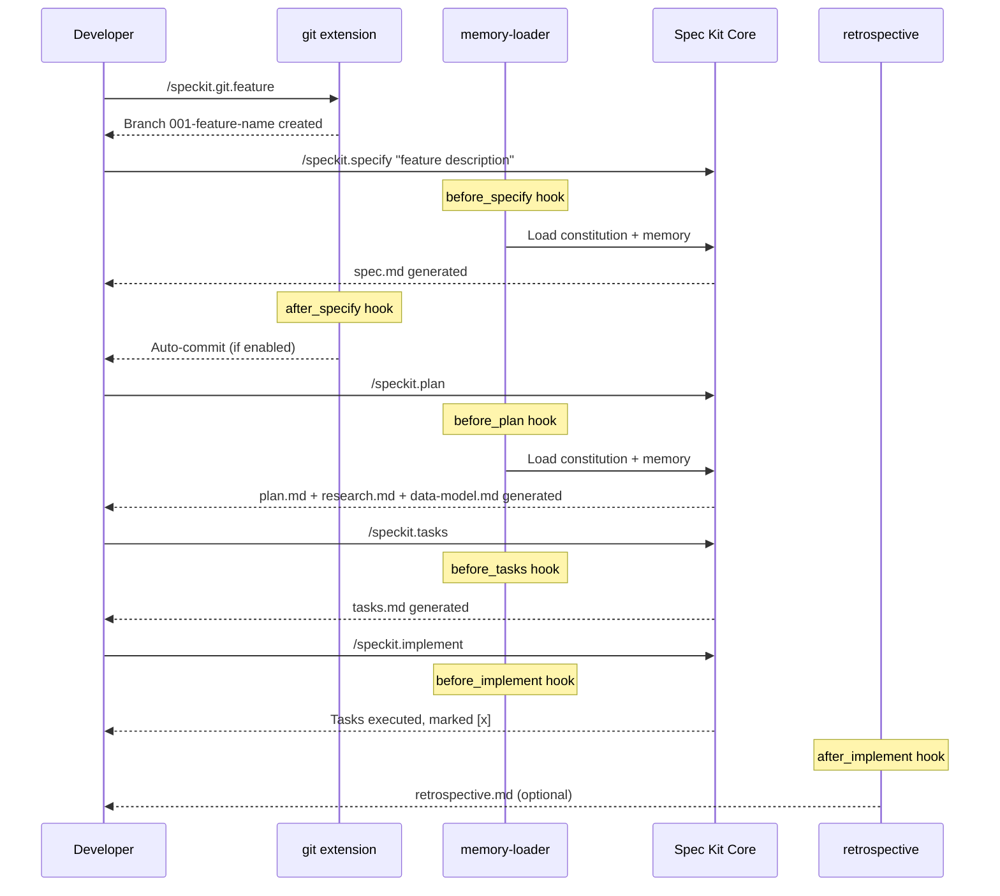
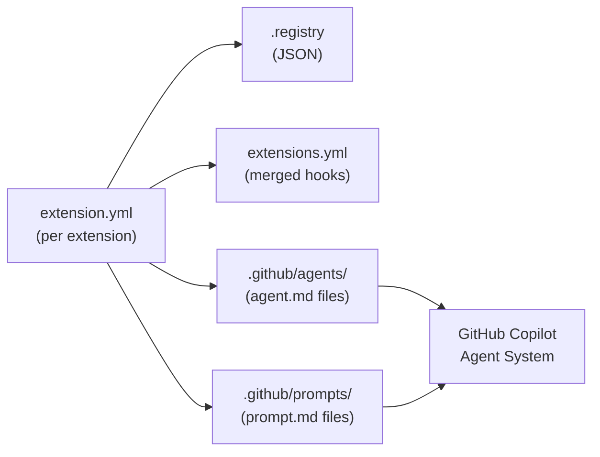
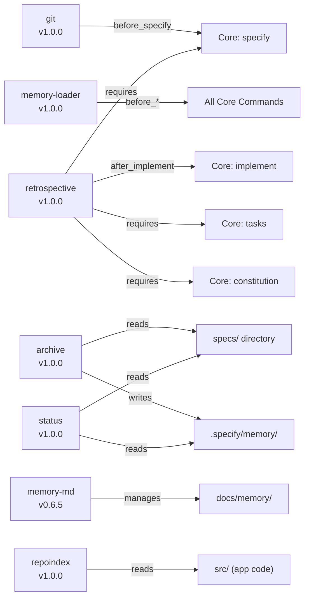

# Module: Spec Kit (.specify/) & Extensions

## Business Context

### Module Purpose

Spec Kit is the **Specification-Driven Development (SDD) workflow engine** embedded in this project. It provides a structured lifecycle for turning a natural-language feature idea into a specification, implementation plan, task list, and finally code — all orchestrated through AI agent commands and lifecycle hooks. The `.specify/` directory is the core runtime configuration, while `.github/agents/` and `.github/prompts/` contain the Copilot agent definitions that expose each command.

### Business Scenarios

1. **New Feature Development** — A developer describes a feature; Spec Kit creates a feature branch, writes a structured spec, generates a plan, breaks it into tasks, and implements them with review gates between phases.
2. **Project Governance** — A constitution file defines non-negotiable principles (TDD, architecture constraints) that are checked before every plan.
3. **Knowledge Preservation** — Durable lessons, decisions, and bug patterns are captured into layered memory files so institutional knowledge persists across features.
4. **Post-Merge Archival** — After a feature merges, its spec artifacts are archived into main project memory.
5. **Retrospective Analysis** — After implementation, spec adherence and drift are measured to improve future SDD cycles.
6. **Repository Indexing** — Generate overview, architecture, and module-level documentation for brownfield onboarding.

### Domain Concepts

| Concept | Description |
|---------|-------------|
| **Constitution** | Project-level principles that gate all plans and implementations |
| **Specification (spec.md)** | User stories, acceptance scenarios, requirements, and edge cases for a feature |
| **Plan (plan.md)** | Technical design, project structure, data models, and contracts |
| **Tasks (tasks.md)** | Ordered, dependency-aware task list organized by user story |
| **Feature Branch** | Git branch with sequential (`001-`) or timestamp (`20260425-`) numbering |
| **Hook** | Lifecycle callback (before/after a command) that auto-runs extensions |
| **Memory** | Layered knowledge: constitution (stable), durable memory (cross-feature), feature memory (local) |
| **Extension** | Pluggable capability registered via `extension.yml`, providing commands, hooks, and config |

### Use Cases

1. **Start a new feature**: Developer runs `/speckit.specify "add user auth"` → git extension creates branch `001-add-user-auth` → memory-loader injects constitution → agent generates `spec.md`
2. **Plan implementation**: `/speckit.plan` → reads spec, research, constitution → generates `plan.md`, `data-model.md`, `contracts/`
3. **Generate tasks**: `/speckit.tasks` → reads plan + spec → generates `tasks.md` with phases and parallel markers
4. **Implement**: `/speckit.implement` → processes tasks sequentially, marking `[x]` as completed
5. **Review quality**: `/speckit.analyze` → cross-artifact consistency check across spec, plan, and tasks
6. **Capture lessons**: `/speckit.memory-md.capture` → reflects on completed work → updates durable memory if high-signal
7. **Archive feature**: `/speckit.archive.run specs/001-feature` → merges feature artifacts into project-level memory
8. **Check status**: `/speckit.status` → shows current phase, artifact status, task progress, extensions

## Technical Overview

### Module Type

Configuration + AI Agent Orchestration (no runtime code — all execution is through Copilot agents and PowerShell scripts)

### Key Technologies

- **AI Integration**: GitHub Copilot agents (`.agent.md` files) + prompt files (`.prompt.md`)
- **Scripting**: PowerShell (`.ps1`) for branch creation, auto-commit, prerequisite checking
- **Configuration**: YAML (`extension.yml`, `extensions.yml`, `workflow.yml`, `git-config.yml`) + JSON (`init-options.json`, `.registry`, manifests)
- **Templates**: Markdown templates for spec, plan, tasks, checklist, constitution

### Spec Kit Version

**0.8.1.dev0** (development build)

### Module Structure

```
.specify/                           # Spec Kit core runtime
├── init-options.json               # Project initialization config
├── integration.json                # Active integration (copilot)
├── extensions.yml                  # Hook registry — all before_*/after_* lifecycle hooks
├── memory/
│   └── constitution.md             # Project constitution (v1.0.0 — ratified)
├── templates/
│   ├── spec-template.md            # Feature specification template
│   ├── plan-template.md            # Implementation plan template
│   ├── tasks-template.md           # Task list template
│   ├── checklist-template.md       # Custom checklist template
│   └── constitution-template.md    # Constitution template
├── scripts/powershell/
│   ├── common.ps1                  # Shared functions (Find-SpecifyRoot, Get-RepoRoot, Get-CurrentBranch)
│   ├── check-prerequisites.ps1     # Unified prerequisite validation
│   ├── create-new-feature.ps1      # Feature branch creation
│   └── setup-plan.ps1              # Plan directory setup
├── workflows/
│   ├── workflow-registry.json      # Registered workflows
│   └── speckit/workflow.yml        # Full SDD cycle: specify → plan → tasks → implement
├── integrations/
│   ├── copilot.manifest.json       # Installed Copilot agent/prompt file hashes
│   └── speckit.manifest.json       # Installed script/template file hashes
├── extensions/
│   ├── .registry                   # Extension registry with versions and hashes
│   ├── .cache/                     # Extension download cache
│   ├── git/                        # Git Branching Workflow extension
│   ├── memory-loader/              # Memory Loader extension
│   ├── memory-md/                  # Memory MD (durable markdown memory) extension
│   ├── repoindex/                  # Repository Index extension
│   ├── archive/                    # Archive extension
│   ├── retrospective/              # Retrospective extension
│   └── status/                     # Status extension
│
.github/agents/                     # 28 Copilot agent definitions
│   ├── speckit.specify.agent.md
│   ├── speckit.plan.agent.md
│   ├── speckit.tasks.agent.md
│   ├── speckit.implement.agent.md
│   ├── speckit.analyze.agent.md
│   ├── speckit.clarify.agent.md
│   ├── speckit.checklist.agent.md
│   ├── speckit.constitution.agent.md
│   ├── speckit.taskstoissues.agent.md
│   ├── speckit.git.*.agent.md          # 5 git commands
│   ├── speckit.memory-loader.*.agent.md # 1 memory-loader command
│   ├── speckit.memory-md.*.agent.md     # 6 memory-md commands
│   ├── speckit.repoindex*.agent.md      # 3 repoindex commands
│   ├── speckit.retrospective.*.agent.md # 1 retrospective command
│   └── speckit.status*.agent.md         # 2 status commands
│
.github/prompts/                    # 28 Copilot prompt files (1:1 with agents)
    ├── speckit.specify.prompt.md
    ├── speckit.plan.prompt.md
    └── ... (mirrors agents/)
```

## Components

### Core Commands (Built-in)

| Command | Agent File | Purpose |
|---------|-----------|---------|
| `speckit.specify` | `speckit.specify.agent.md` | Generate feature specification from natural-language description |
| `speckit.clarify` | `speckit.clarify.agent.md` | Ask up to 5 clarification questions and encode answers into spec |
| `speckit.plan` | `speckit.plan.agent.md` | Generate implementation plan with research, data model, contracts |
| `speckit.tasks` | `speckit.tasks.agent.md` | Generate dependency-ordered task list from plan + spec |
| `speckit.implement` | `speckit.implement.agent.md` | Execute all tasks, marking each complete |
| `speckit.analyze` | `speckit.analyze.agent.md` | Cross-artifact consistency and quality analysis |
| `speckit.checklist` | `speckit.checklist.agent.md` | Generate custom checklist for current feature |
| `speckit.constitution` | `speckit.constitution.agent.md` | Create or update project constitution |
| `speckit.taskstoissues` | `speckit.taskstoissues.agent.md` | Convert tasks to GitHub Issues |

### Extension: git (v1.0.0)

**Author**: spec-kit-core | **Purpose**: Feature branch creation, numbering, validation, and auto-commit

| Command | Description |
|---------|-------------|
| `speckit.git.initialize` | Initialize a Git repository with initial commit |
| `speckit.git.feature` | Create feature branch with sequential/timestamp numbering |
| `speckit.git.validate` | Validate current branch follows naming conventions |
| `speckit.git.remote` | Detect Git remote URL for GitHub integration |
| `speckit.git.commit` | Auto-commit changes after Spec Kit commands (configurable per-event) |

**Hooks registered**: `before_constitution` (initialize), `before_specify` (feature branch), `before_*/after_*` (auto-commit on most events)

**Configuration**: `git-config.yml` — `branch_numbering` (sequential/timestamp), `auto_commit` per-event toggles and messages

**Scripts**: PowerShell + Bash scripts for `create-new-feature`, `auto-commit`

### Extension: memory-loader (v1.0.0)

**Author**: KevinBrown5280 | **Purpose**: Load `.specify/memory/` files before every lifecycle command

| Command | Description |
|---------|-------------|
| `speckit.memory-loader.load` | Read all `.md` files from `.specify/memory/` and output contents |

**Hooks registered**: `before_specify`, `before_plan`, `before_tasks`, `before_implement`, `before_clarify`, `before_checklist`, `before_analyze` — all mandatory

**Behavior**: Read-only. Outputs each memory file as a headed section. Skips silently if directory is empty.

### Extension: memory-md (v0.6.5)

**Author**: DyanGalih | **Purpose**: Repository-native Markdown memory — capture durable decisions, bugs, and project context

| Command | Description |
|---------|-------------|
| `speckit.memory-md.bootstrap` | Set up layered memory structure (`docs/memory/`, `specs/`, templates) |
| `speckit.memory-md.plan-with-memory` | Read memory, synthesize constraints, gate planning on conflicts |
| `speckit.memory-md.capture` | Capture durable lessons from completed work with evidence requirements |
| `speckit.memory-md.capture-from-diff` | Review code diffs, persist only durable evidenced lessons |
| `speckit.memory-md.audit` | Audit memory quality: stale, duplicate, trivial, contradictory entries |
| `speckit.memory-md.log-finding` | Turn audit finding into tracker-ready GitHub/GitLab/Jira issue |

**Memory layers** (bootstrapped via `speckit.memory-md.bootstrap`):
- `docs/memory/PROJECT_CONTEXT.md` — stable product/domain context ✓ created (template)
- `docs/memory/ARCHITECTURE.md` — system shape and boundaries ✓ created (template)
- `docs/memory/DECISIONS.md` — explicit tradeoffs and chosen direction ✓ created (template)
- `docs/memory/BUGS.md` — recurring failure modes and prevention ✓ created (template)
- `docs/memory/WORKLOG.md` — concise high-value milestone notes ✓ created (template)
- Feature-level `memory.md` + `memory-synthesis.md` — per-feature context (created per feature)
- `specs/README.md` — spec folder conventions guide ✓ created

### Extension: repoindex (v1.0.0)

**Author**: Yiyu Liu | **Purpose**: Generate repository index documents for brownfield development onboarding

| Command | Description |
|---------|-------------|
| `speckit.repoindex.overview` | Generate project overview (tech stack, architecture, getting started) |
| `speckit.repoindex.architecture` | Generate deep architecture analysis (components, dependencies, performance) |
| `speckit.repoindex.module` | Generate module-level analysis (business scenarios, APIs, data models) |

**Output directory**: `.github/speckit/repo_index/`

### Extension: archive (v1.0.0)

**Author**: Stanislav Deviatov | **Purpose**: Archive merged feature specs into main project memory

| Command | Description |
|---------|-------------|
| `speckit.archive.run` | Archive feature specification into `.specify/memory/` after merge |

**Input**: Feature spec directory path (e.g., `specs/007-invoice-settings`) + optional scope modifiers (`--spec-only`, `--plan-only`, `--changelog-only`, `--agent-only`)

**Process**: Reads merged feature spec/plan → resolves gaps and conflicts with existing memory → updates constitution-aligned project memory

### Extension: retrospective (v1.0.0)

**Author**: emi-dm | **Purpose**: Post-implementation spec adherence and drift analysis

| Command | Description |
|---------|-------------|
| `speckit.retrospective.analyze` | Generate `retrospective.md` measuring spec adherence vs. actual implementation |

**Hooks**: `after_implement` (optional, prompted)

**Requirements**: Requires `speckit.tasks`, `speckit.implement`, `speckit.constitution`, `speckit.specify`, `speckit.checklist` commands

**Thresholds**: ≥80% task completion → full retrospective; <50% → requires confirmation; Human gate required before any spec modifications

**Handoffs**: Can chain to → `speckit.constitution` (update principles), `speckit.specify` (new feature), `speckit.checklist` (new checklist)

### Extension: status (v1.0.0)

**Author**: KhawarHabibKhan | **Purpose**: Show unified SDD workflow progress dashboard

| Command | Description |
|---------|-------------|
| `speckit.status.show` / `speckit.status` | Show project status: feature, artifacts, tasks, phase, extensions |

**Phase detection**: No spec → Not Started; spec only → Plan; plan exists → Tasks; tasks in progress → Implement; all done → Complete

## Workflow

### Full SDD Lifecycle



### Hook Execution Order

Every core command follows this pattern:

```
before_* hooks → command execution → after_* hooks
```

For example, `/speckit.plan`:
1. `before_plan` → `speckit.git.commit` (optional, auto-commit outstanding changes)
2. `before_plan` → `speckit.memory-loader.load` (mandatory, load memory)
3. **Execute plan command** → generate plan.md
4. `after_plan` → `speckit.git.commit` (optional, commit plan changes)

### Extension Registration Flow



## Dependencies

### Internal Dependencies

- **`.specify/memory/constitution.md`** → Read by `memory-loader` before every command
- **`.specify/templates/*`** → Used by core commands to scaffold new artifacts
- **`.specify/scripts/powershell/common.ps1`** → Shared by `check-prerequisites.ps1` and `create-new-feature.ps1`
- **`.github/copilot-instructions.md`** — References Spec Kit workflow, memory layers, and required memory workflow in project-level AI context
- **`docs/memory/*.md`** → Read by `memory-loader` (via durable memory layer) and by agents following the Required Workflow in `copilot-instructions.md`
- **`specs/README.md`** → Documents feature spec folder structure and memory conventions

### Extension Inter-Dependencies



### External Dependencies

| Dependency | Used By | Purpose |
|-----------|---------|---------|
| **Git** | git extension | Branch creation, validation, auto-commit |
| **GitHub Copilot** | All agents | AI execution engine for all commands |
| **PowerShell** | git, core scripts | Script execution (branch creation, prerequisites) |

### Configuration Dependencies

| Variable / File | Required | Description |
|----------------|----------|-------------|
| `.specify/init-options.json` | Yes | Spec Kit version, integration type, branch numbering strategy |
| `.specify/integration.json` | Yes | Active integration (copilot) and version |
| `.specify/extensions.yml` | Yes | Hook registry — all lifecycle hooks |
| `.specify/extensions/.registry` | Yes | Extension version tracking and integrity hashes |
| `git-config.yml` | No | Auto-commit toggles and branch numbering |

## File Organization

### Component Distribution

- Core config: 3 files (`init-options.json`, `integration.json`, `extensions.yml`)
- Templates: 5 files
- Scripts: 4 PowerShell files
- Workflows: 2 files
- Memory: 1 file (constitution)
- Extensions: 7 extensions (~85 files across commands, configs, docs, scripts)
- Agent definitions: 28 files (`.github/agents/`)
- Prompt definitions: 28 files (`.github/prompts/`)
- Integration manifests: 2 files

**Total**: ~131 files in `.specify/` + 56 files in `.github/agents/` and `.github/prompts/`

### Key Files

1. **`extensions.yml`** — The central hook registry. All lifecycle hooks from all extensions are merged here. Controls what runs before/after every command.
2. **`.registry`** — Extension integrity database. Records version, SHA-256 hash, installation timestamp, and registered commands for each extension.
3. **`copilot.manifest.json`** — Maps every `.github/agents/*.agent.md` and `.github/prompts/*.prompt.md` to its SHA-256 hash for integrity checking.
4. **`common.ps1`** — Shared PowerShell functions (`Find-SpecifyRoot`, `Get-RepoRoot`, `Get-CurrentBranch`) used by all scripts.
5. **`workflow.yml`** — Defines the full SDD cycle (specify → review → plan → review → tasks → implement) with gate/abort control.

## Quality Observations

### Strengths

- **Well-structured extension system** — Each extension has a clear `extension.yml` manifest, isolated commands, and typed hooks.
- **Lifecycle hooks** — Consistent before/after pattern ensures memory is always loaded and commits are always offered.
- **Integrity tracking** — SHA-256 hashes in `.registry` and manifests enable tamper detection.
- **Template-driven** — All artifacts use structured templates with clear placeholder instructions.
- **Gradual adoption** — Each command can be used independently; the full workflow is optional.

### Concerns

_(No open concerns — all 5 original concerns have been resolved.)_

### Recommendations

_(No open recommendations)_

---

**Generated**: April 25, 2026 (refreshed) | **Spec Kit Extension**: repoindex v1.0.0
