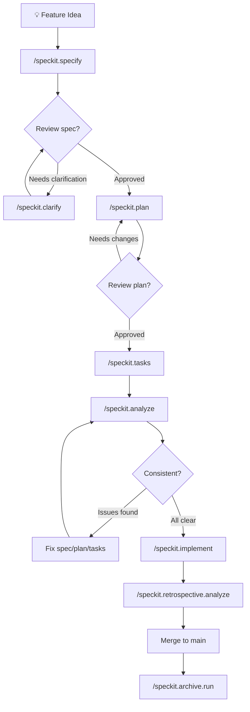

# Module: Spec Kit — AI Development Workflow & Commands

## Business Context

### Module Purpose

Spec Kit is the **Specification-Driven Development (SDD) workflow engine** for this project. It provides a structured lifecycle for turning a natural-language feature idea into a specification, implementation plan, task list, and finally code — all orchestrated through AI agent commands in GitHub Copilot Chat. Every command is backed by a `.agent.md` file (defining the agent mode) and a `.prompt.md` file (the execution prompt).

### How AI Development Works in This Project

1. **You describe what you want to build** in natural language
2. **AI agents execute the SDD lifecycle** — each phase has a dedicated command
3. **Lifecycle hooks auto-fire** — memory is loaded before every command, artifacts are auto-committed after
4. **The constitution gates every plan** — 5 non-negotiable principles are checked before design proceeds
5. **Knowledge persists across features** — durable memory captures lessons; feature memory captures context

---

## Quick Reference: All 22 Commands

### Core SDD Lifecycle (9 commands)

These are the primary commands that drive feature development:

| # | Command | What It Does | Input | Output |
|---|---------|-------------|-------|--------|
| 1 | `/speckit.constitution` | Create/update project principles | Interactive Q&A or directives | `.specify/memory/constitution.md` |
| 2 | `/speckit.specify "description"` | Generate feature specification | Natural-language feature description | `specs/NNN-name/spec.md` |
| 3 | `/speckit.clarify` | Ask ≤5 clarification questions | Auto-scans spec for ambiguities | Updates `spec.md` with Clarifications section |
| 4 | `/speckit.plan` | Generate implementation plan | Reads spec.md + constitution | `plan.md`, `research.md`, `data-model.md`, `quickstart.md` |
| 5 | `/speckit.tasks` | Generate dependency-ordered task list | Reads plan.md + spec.md | `tasks.md` with phases and `[P]` parallel markers |
| 6 | `/speckit.implement` | Execute all tasks sequentially | Reads tasks.md | Marks `[x]` as completed, edits source files |
| 7 | `/speckit.analyze` | Cross-artifact consistency check | Reads spec + plan + tasks | Analysis report with coverage matrix |
| 8 | `/speckit.checklist` | Generate custom verification checklist | User-specified checklist type | `checklists/<name>.md` |
| 9 | `/speckit.taskstoissues` | Convert tasks to GitHub Issues | Reads tasks.md | GitHub Issues (external) |

### Git Workflow (5 commands)

| Command | What It Does | When It Runs |
|---------|-------------|--------------|
| `/speckit.git.initialize` | `git init` + initial commit | Auto: before `/speckit.constitution` |
| `/speckit.git.feature` | Create branch `NNN-feature-name` | Auto: before `/speckit.specify` |
| `/speckit.git.validate` | Check branch naming convention | On demand |
| `/speckit.git.remote` | Detect Git remote URL | On demand |
| `/speckit.git.commit` | Auto-commit with descriptive message | Auto: after every lifecycle command (8 events enabled) |

### Memory Management (1 command)

| Command | What It Does | When It Runs |
|---------|-------------|--------------|
| `/speckit.memory-loader.load` | Read `.specify/memory/` files into context | Auto: before every lifecycle command (mandatory) |

### Repository Indexing (3 commands)

| Command | What It Does | Output |
|---------|-------------|--------|
| `/speckit.repoindex.overview` | Generate project overview (tech, architecture, getting started) | `.github/speckit/repo_index/overview.md` |
| `/speckit.repoindex.architecture` | Deep architecture analysis (components, deps, performance) | `.github/speckit/repo_index/architecture.md` |
| `/speckit.repoindex.module "topic"` | Module-level analysis (business scenarios, APIs, data) | `.github/speckit/repo_index/<module>_profile.md` + `_fileindex.json` |

### Post-Implementation (2 commands)

| Command | What It Does | When It Runs |
|---------|-------------|--------------|
| `/speckit.retrospective.analyze` | Measure spec adherence vs actual implementation | Auto-offered: after `/speckit.implement` |
| `/speckit.archive.run specs/NNN-name` | Archive feature spec into project memory | After merge to main |

### Status (2 commands)

| Command | What It Does |
|---------|-------------|
| `/speckit.status` | Show current phase, artifacts, task progress, extensions |
| `/speckit.status.show` | Same as above (alias) |

---

## Complete Feature Development Workflow

### Step-by-Step: From Idea to Merged Code



### Detailed Command Flow with Hooks

Each command follows this pattern:

```
before_* hooks → COMMAND EXECUTION → after_* hooks
```

#### Phase 1: Specify

```
User: /speckit.specify "add user authentication"
  ├── [HOOK] speckit.git.feature        → Creates branch 002-add-user-auth
  ├── [HOOK] speckit.memory-loader.load → Loads constitution + memory
  ├── [EXEC] Generate spec.md           → User stories, acceptance scenarios, requirements
  └── [HOOK] speckit.git.commit         → "[Spec Kit] Add specification"
```

**Output**: `specs/002-add-user-auth/spec.md`

#### Phase 2: Clarify (optional, repeatable)

```
User: /speckit.clarify
  ├── [HOOK] speckit.git.commit         → Save outstanding changes (optional)
  ├── [HOOK] speckit.memory-loader.load → Load context
  ├── [EXEC] Scan spec for ambiguities  → Ask ≤5 questions, encode answers
  └── [HOOK] speckit.git.commit         → "[Spec Kit] Clarify specification"
```

**Output**: Updated `spec.md` with Clarifications section

#### Phase 3: Plan

```
User: /speckit.plan
  ├── [HOOK] speckit.git.commit         → Save outstanding changes (optional)
  ├── [HOOK] speckit.memory-loader.load → Load context
  ├── [EXEC] Constitution Check         → GATE: all 5 principles must PASS
  ├── [EXEC] Phase 0: Research          → Generate research.md
  ├── [EXEC] Phase 1: Design            → Generate data-model.md, quickstart.md
  ├── [EXEC] Write plan.md              → Technical context, project structure
  └── [HOOK] speckit.git.commit         → "[Spec Kit] Add implementation plan"
```

**Output**: `plan.md`, `research.md`, `data-model.md`, `quickstart.md`

#### Phase 4: Tasks

```
User: /speckit.tasks
  ├── [HOOK] speckit.git.commit         → Save outstanding changes (optional)
  ├── [HOOK] speckit.memory-loader.load → Load context
  ├── [EXEC] Read plan + spec           → Generate phased, dependency-ordered tasks
  └── [HOOK] speckit.git.commit         → "[Spec Kit] Add tasks"
```

**Output**: `tasks.md` with `- [ ] T001 [P] [US1] description` format

#### Phase 5: Analyze (optional, recommended)

```
User: /speckit.analyze
  ├── [HOOK] speckit.git.commit         → Save outstanding changes (optional)
  ├── [HOOK] speckit.memory-loader.load → Load context
  ├── [EXEC] Cross-check spec ↔ plan ↔ tasks → Coverage matrix, drift detection
  └── [HOOK] speckit.git.commit         → "[Spec Kit] Add analysis report"
```

**Output**: Analysis report with requirement coverage, ambiguities, inconsistencies

#### Phase 6: Implement

```
User: /speckit.implement
  ├── [HOOK] speckit.git.commit         → Save outstanding changes (optional)
  ├── [HOOK] speckit.memory-loader.load → Load context
  ├── [EXEC] Process tasks T001→T00N    → Edit files, mark [x] in tasks.md
  ├── [HOOK] speckit.git.commit         → "[Spec Kit] Implementation progress"
  └── [HOOK] speckit.retrospective.analyze → Offered (optional)
```

**Output**: Source code changes + all tasks marked `[x]`

#### Phase 7: Retrospective (optional)

```
User: /speckit.retrospective.analyze
  ├── [EXEC] Compare spec vs actual     → Adherence %, drift table, deviations
  └── [HANDOFF] Can chain to:
      ├── /speckit.constitution         → Update principles based on learnings
      ├── /speckit.specify              → New feature from findings
      └── /speckit.checklist            → Checklist from findings
```

**Output**: `retrospective.md` with adherence score, deviation analysis, recommendations

#### Phase 8: Archive

```
User: /speckit.archive.run specs/NNN-feature-name
  ├── [EXEC] Read feature artifacts     → Merge into .specify/memory/
  └── [OUTPUT] Project-level memory     → Updated with feature knowledge
```

---

## File Layout

### Feature Spec Directory (per feature)

```
specs/NNN-feature-name/
├── spec.md              # User stories, requirements, acceptance scenarios
├── plan.md              # Technical design, project structure, constitution check
├── tasks.md             # Phased task list with [P] parallel markers
├── research.md          # Technology research and decisions
├── data-model.md        # Entity descriptions (if applicable)
├── quickstart.md        # Verification steps after implementation
├── retrospective.md     # Post-implementation spec adherence analysis
└── checklists/
    └── requirements.md  # Spec quality validation checklist
```

### Governance Memory

```
.specify/memory/
└── constitution.md      # v1.0.1 — 5 principles + governance
```

### Spec Kit Infrastructure

```
.specify/
├── init-options.json    # Integration: copilot, branch numbering: sequential
├── integration.json     # Active integration and Spec Kit version (0.8.1.dev0)
├── extensions.yml       # Hook registry — all lifecycle events
├── feature.json         # Currently active feature directory pointer
├── templates/           # 5 templates (spec, plan, tasks, checklist, constitution)
├── scripts/powershell/  # 4 scripts (common, check-prerequisites, create-new-feature, setup-plan)
├── workflows/speckit/   # Full SDD cycle workflow definition
├── integrations/        # Copilot + Spec Kit manifest files (SHA-256 integrity)
└── extensions/          # 6 extensions (git, memory-loader, repoindex, archive, retrospective, status)

.github/agents/          # 22 Copilot agent definitions (.agent.md)
.github/prompts/         # 22 Copilot prompt files (.prompt.md)
```

---

## Hook Configuration (Current State)

### Auto-Commit Configuration

Auto-commit is **enabled for all `after_*` events** (except `after_taskstoissues`). All `before_*` events remain disabled to avoid committing work-in-progress.

| Event | before_* | after_* | Message |
|-------|----------|---------|---------|
| constitution | — | ✓ enabled | `[Spec Kit] Add project constitution` |
| specify | — | ✓ enabled | `[Spec Kit] Add specification` |
| clarify | — | ✓ enabled | `[Spec Kit] Clarify specification` |
| plan | — | ✓ enabled | `[Spec Kit] Add implementation plan` |
| tasks | — | ✓ enabled | `[Spec Kit] Add tasks` |
| implement | — | ✓ enabled | `[Spec Kit] Implementation progress` |
| checklist | — | ✓ enabled | `[Spec Kit] Add checklist` |
| analyze | — | ✓ enabled | `[Spec Kit] Add analysis report` |
| taskstoissues | — | ✗ disabled | — |

### Memory Loading

`speckit.memory-loader.load` fires **before every lifecycle command** (mandatory, not optional). It reads all `.md` files from `.specify/memory/` and outputs them as context.

### Retrospective Hook

`speckit.retrospective.analyze` is **offered after `/speckit.implement`** (optional, prompted). Generates spec adherence analysis with deviation scoring.

---

## Constitution v1.0.1 (Active)

| # | Principle | Key Rule |
|---|-----------|----------|
| I | **Cross-Platform Parity** | Every feature MUST work on iOS, Android, and Web |
| II | **Token-Based Theming** | All colors/spacing from `theme.ts`; use `ThemedText`/`ThemedView` |
| III | **Platform File Splitting** | Non-trivial platform differences use `.web.tsx` suffix |
| IV | **StyleSheet Discipline** | `StyleSheet.create()` for all styles; `Spacing` scale for dimensions |
| V | **Test-First for New Features** | New features MUST include tests. **Exemption**: docs/config-only features use manual verification instead |

**Governance**: Constitution supersedes conflicting conventions. Amendments require version bump + rationale. Plans MUST pass Constitution Check gate.

---

## Installed Extensions (6)

| Extension | Version | Author | Commands | Purpose |
|-----------|---------|--------|----------|---------|
| **git** | 1.0.0 | spec-kit-core | 5 | Branch creation, naming, auto-commit |
| **memory-loader** | 1.0.0 | KevinBrown5280 | 1 | Load `.specify/memory/` before commands |
| **repoindex** | 1.0.0 | Yiyu Liu | 3 | Repository documentation generation |
| **archive** | 1.0.0 | Stanislav Deviatov | 1 | Post-merge feature archival |
| **retrospective** | 1.0.0 | emi-dm | 1 | Spec adherence and drift analysis |
| **status** | 1.0.0 | KhawarHabibKhan | 1 | SDD workflow progress dashboard |

## Quality Status

### Concerns

_(No open concerns — all 5 original concerns have been resolved.)_

### Recommendations

_(No open recommendations)_

---

**Generated**: April 25, 2026 | **Spec Kit Version**: 0.8.1.dev0 | **Constitution**: v1.0.1
