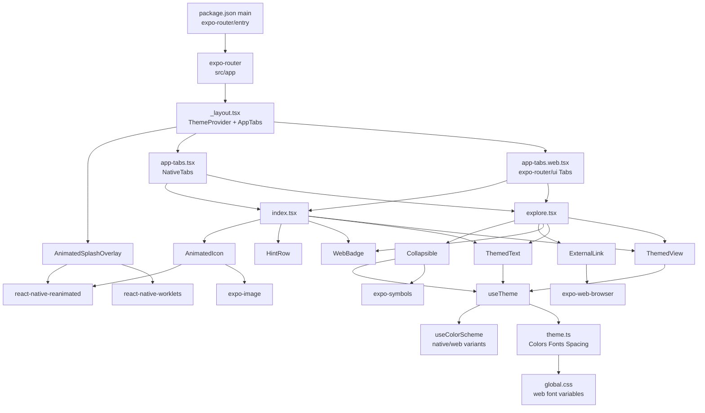
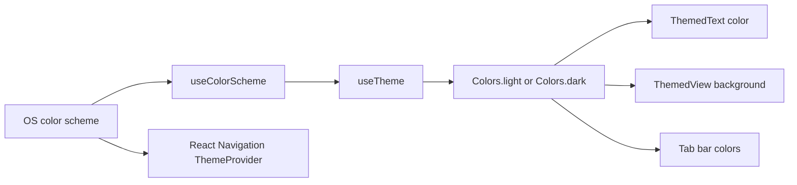
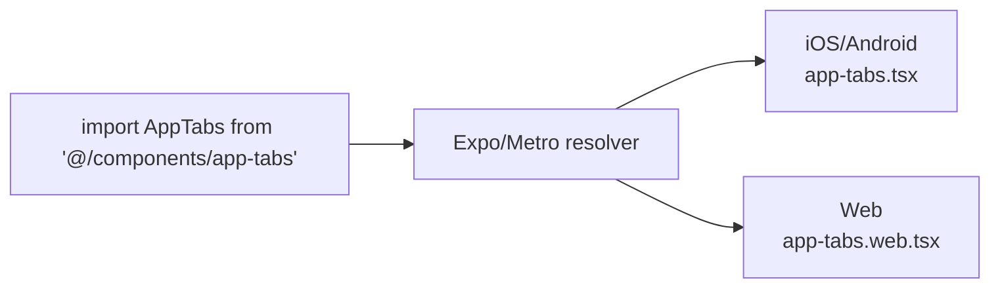
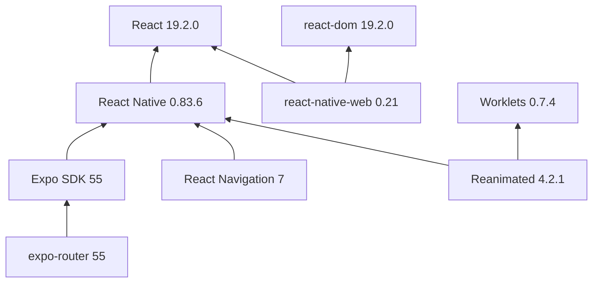
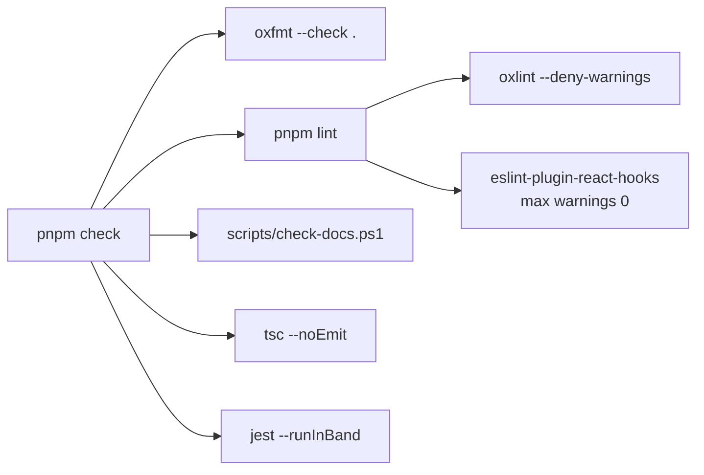
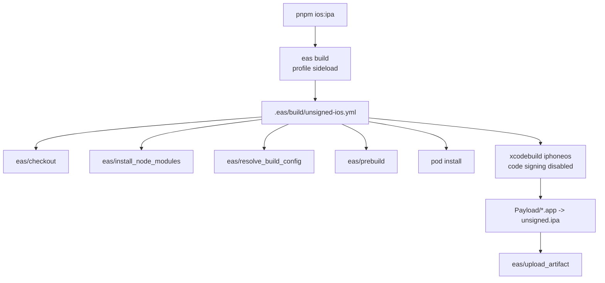

# spot - Architecture Documentation

This generated profile describes the current workspace architecture as of 2026-04-28. It is based on current repository source files and configuration. Documentation-system conventions are taken only from [README.md](README.md) and [../.specify/memory/doc-system.md](../.specify/memory/doc-system.md).

## 1. Project Structure

### Directory Layout

```text
spot/
+-- app.json                     # Expo app metadata, plugins, typed routes, React Compiler
+-- eas.json                     # EAS CLI and build profile configuration
+-- package.json                 # Expo entry point, scripts, runtime/dev dependencies
+-- pnpm-workspace.yaml          # pnpm nodeLinker: hoisted
+-- tsconfig.json                # TypeScript strict config and path aliases
+-- eslint.config.cjs             # ESLint flat config for official React Hooks rules
+-- oxlint.json                  # OXC lint configuration
+-- .oxfmtrc.json                # OXC formatter configuration
+-- .gitattributes               # Git CRLF working-tree policy
+-- .editorconfig                # Editor CRLF and whitespace policy
+-- jest.config.cjs               # Jest Expo + React Native Testing Library config
+-- scripts/
+|   +-- check-docs.ps1           # Documentation and CRLF gate
+-- .eas/
+|   +-- build/
+|       +-- unsigned-ios.yml     # Custom unsigned iOS IPA build workflow
+-- assets/
+|   +-- expo.icon/               # iOS icon source package
+|   +-- images/                  # App icons, splash art, tutorial images, tab icons
+-- src/
+|   +-- app/                     # expo-router route files
+|   +-- components/              # Shared UI, navigation, platform variants
+|   +-- constants/               # Theme tokens and layout constants
+|   +-- hooks/                   # Theme and color-scheme hooks
+|   +-- types/                   # Reserved for shared types; no files currently discovered
+|   +-- global.css               # Web font CSS custom properties
+-- test/
+|   +-- setup.ts                 # Jest shared mocks and RN gesture setup
+|   +-- style-mock.js            # CSS/style mock
+|   +-- unit/                    # Jest Expo unit tests
+-- docs/
+|   +-- *.md                     # Curated index, generated profiles, and registry-derived references
+|   +-- _index/                  # Machine-readable generated file indexes
+|   +-- _decisions/              # ADRs for human decisions
+|   +-- _howto/                  # External-tool procedures
+-- specs/                       # Spec Kit feature artifacts
+-- .specify/                    # Spec Kit engine, extensions, workflows, memory
+-- .agents/                     # Local agent skills
+-- .github/                     # Agent instructions, prompts, repository automation
+```

### Module Organization

The app is a single-package Expo workspace. There are no nested local packages. Runtime source is organized by concern:

| Area | Files | Responsibility |
|------|-------|----------------|
| Routes | [../src/app/_layout.tsx](../src/app/_layout.tsx), [../src/app/index.tsx](../src/app/index.tsx), [../src/app/explore.tsx](../src/app/explore.tsx) | Expo Router layout and screens |
| Navigation | [../src/components/app-tabs.tsx](../src/components/app-tabs.tsx), [../src/components/app-tabs.web.tsx](../src/components/app-tabs.web.tsx) | Separate native and web tab shells |
| Themed primitives | [../src/components/themed-text.tsx](../src/components/themed-text.tsx), [../src/components/themed-view.tsx](../src/components/themed-view.tsx) | Theme-aware text and view wrappers |
| UI components | [../src/components/hint-row.tsx](../src/components/hint-row.tsx), [../src/components/external-link.tsx](../src/components/external-link.tsx), [../src/components/web-badge.tsx](../src/components/web-badge.tsx), [../src/components/ui/collapsible.tsx](../src/components/ui/collapsible.tsx) | Reusable screen building blocks |
| Animation | [../src/components/animated-icon.tsx](../src/components/animated-icon.tsx), [../src/components/animated-icon.web.tsx](../src/components/animated-icon.web.tsx), [../src/components/animated-icon.module.css](../src/components/animated-icon.module.css) | Native/web splash and logo animation |
| Theme system | [../src/constants/theme.ts](../src/constants/theme.ts), [../src/hooks/use-theme.ts](../src/hooks/use-theme.ts), [../src/hooks/use-color-scheme.ts](../src/hooks/use-color-scheme.ts), [../src/hooks/use-color-scheme.web.ts](../src/hooks/use-color-scheme.web.ts) | Tokens and palette resolution |
| Tests | [../test/setup.ts](../test/setup.ts), [../test/unit/examples](../test/unit/examples) | Jest Expo setup and example coverage |

Path aliases in [../tsconfig.json](../tsconfig.json):

| Alias | Target | Current use |
|-------|--------|-------------|
| `@/*` | `./src/*` | Source imports such as `@/components/themed-text` |
| `@/assets/*` | `./assets/*` | Static asset imports such as `@/assets/images/react-logo.png` |

### Build Configuration

| Aspect | Current configuration |
|--------|-----------------------|
| Runtime | Expo SDK 55 (`expo ~55.0.17`), React Native 0.83.6, React 19.2.0 |
| Entry point | `expo-router/entry` from [../package.json](../package.json) |
| Router | `expo-router ~55.0.13`, routes under `src/app`, typed routes enabled |
| Compiler | React Compiler enabled by `experiments.reactCompiler: true` |
| Language | TypeScript 5.9 strict mode, extending `expo/tsconfig.base` |
| Package manager | pnpm with `nodeLinker: hoisted` |
| Web output | Static (`web.output: "static"`) |
| Expo plugins | `expo-router`, `expo-splash-screen`, `expo-image` |
| App identifiers | scheme `spot`, iOS bundle ID `com.izkizk8.spot` |

## 2. Core Components

### Application Entry Points

The app starts through `expo-router/entry`, which loads the route tree from `src/app`.

[../src/app/_layout.tsx](../src/app/_layout.tsx) is the root layout. It reads the OS color scheme, selects the React Navigation light or dark theme, renders `AnimatedSplashOverlay`, and mounts `AppTabs`.

| Route | File | Purpose |
|-------|------|---------|
| `/` | [../src/app/index.tsx](../src/app/index.tsx) | Starter home screen with animated Expo logo, hints, and platform-specific dev menu instructions |
| `/explore` | [../src/app/explore.tsx](../src/app/explore.tsx) | Scrollable starter guide with collapsible sections, images, docs links, safe-area handling, and themed surfaces |

### Navigation Layer

Navigation is platform-split rather than branching inline:

| Platform | File | Implementation |
|----------|------|----------------|
| iOS/Android | [../src/components/app-tabs.tsx](../src/components/app-tabs.tsx) | `NativeTabs` from `expo-router/unstable-native-tabs`, with PNG tab icons from `assets/images/tabIcons` |
| Web | [../src/components/app-tabs.web.tsx](../src/components/app-tabs.web.tsx) | `Tabs`, `TabSlot`, `TabList`, and `TabTrigger` from `expo-router/ui`, rendered as a custom top tab bar |

Adding a tab requires changing both tab implementations because native trigger names and web trigger hrefs are declared separately.

### Theme And Design Tokens

[../src/constants/theme.ts](../src/constants/theme.ts) owns the design tokens:

| Token group | Contents |
|-------------|----------|
| `Colors` | Light/dark `text`, `background`, `backgroundElement`, `backgroundSelected`, `textSecondary` |
| `Fonts` | Platform-specific `sans`, `serif`, `rounded`, `mono`; web values come from CSS custom properties |
| `Spacing` | `half`, `one`, `two`, `three`, `four`, `five`, `six` mapped to 2, 4, 8, 16, 24, 32, 64 |
| Layout | `BottomTabInset` and `MaxContentWidth` |

[../src/hooks/use-theme.ts](../src/hooks/use-theme.ts) resolves the active palette from `useColorScheme`. The web variant [../src/hooks/use-color-scheme.web.ts](../src/hooks/use-color-scheme.web.ts) uses `useSyncExternalStore` so static rendering starts in `light` mode before client hydration.

### Themed Component Layer

`ThemedText` and `ThemedView` are the primary UI primitives:

| Component | Role |
|-----------|------|
| `ThemedText` | Applies active text color and typography variants: `default`, `title`, `small`, `smallBold`, `subtitle`, `link`, `linkPrimary`, `code` |
| `ThemedView` | Applies active background color from a theme token, defaulting to `background` |

The app still uses raw React Native primitives for structural layout and interaction (`ScrollView`, `Pressable`, `SafeAreaView`, `View` wrappers), while themed text and themed surfaces flow through project primitives.

### Data Access Layer

No persistence, API client, network data fetching, database layer, repository layer, cache store, or global state manager exists in the current application code. The app is static and presentational.

## 3. Architecture Overview

### Architectural Style

The current app is a view-centric layered Expo architecture:

1. Router and navigation layer: Expo Router entry, `src/app`, root layout, platform-specific tabs.
2. Screen composition layer: Home and Explore routes compose reusable UI.
3. Component layer: themed primitives, links, collapsibles, badges, animation components.
4. Token and hook layer: centralized colors, spacing, fonts, color-scheme resolution.
5. Tooling and delivery layer: pnpm scripts, OXC, ESLint Hooks, TypeScript, Jest Expo, EAS custom build.

### Component Diagram



### Theme Data Flow



The theme flow is read-only. Components derive palette values from the current OS color scheme and static token objects.

### Platform Resolution Flow



The same resolver pattern applies to `animated-icon` and `use-color-scheme`.

### Communication Patterns

| Pattern | Current use |
|---------|-------------|
| Props down | Screens configure reusable components through props |
| Local React state | `Collapsible` stores open/closed state; native splash stores visibility |
| Context | React Navigation `ThemeProvider` supplies navigation theme |
| Hooks | Theme and safe-area data come from hooks |
| External side effect | Native external links open through `expo-web-browser` |

There is no event bus, server sync, background worker, or cross-screen shared state store.

## 4. Detailed Component Analysis

### Root Layout

- Purpose: App shell for theme, splash, and tabs.
- File: [../src/app/_layout.tsx](../src/app/_layout.tsx)
- Dependencies: `@react-navigation/native`, `react-native` color scheme hook, `AnimatedSplashOverlay`, `AppTabs`.
- Note: React Navigation theme selection is separate from the custom `Colors` token object used by app components.

### Home Screen

- Purpose: Starter landing screen.
- File: [../src/app/index.tsx](../src/app/index.tsx)
- Dependencies: `expo-device`, `Platform`, `SafeAreaView`, `AnimatedIcon`, `HintRow`, `WebBadge`, theme tokens.
- Behavior: Shows different dev-menu hints for web, physical devices, Android simulator, and iOS simulator.

### Explore Screen

- Purpose: Starter documentation/example route.
- File: [../src/app/explore.tsx](../src/app/explore.tsx)
- Dependencies: `expo-image`, `expo-symbols`, `ScrollView`, safe-area insets, `Collapsible`, `ExternalLink`, `useTheme`.
- Behavior: Uses `contentInset` and platform-specific content-container padding, with extra bottom inset for the tab bar.

### AppTabs

- Purpose: Route switching between Home and Explore.
- Files: [../src/components/app-tabs.tsx](../src/components/app-tabs.tsx), [../src/components/app-tabs.web.tsx](../src/components/app-tabs.web.tsx)
- Native dependencies: `expo-router/unstable-native-tabs`, PNG tab icon assets.
- Web dependencies: `expo-router/ui`, `expo-symbols`, `TabButton`, `CustomTabList`.
- Risk: The native implementation uses an unstable Expo Router API, so SDK upgrades should re-test tab behavior.

### AnimatedIcon And Splash Overlay

- Purpose: App starter visual identity and launch transition.
- Files: [../src/components/animated-icon.tsx](../src/components/animated-icon.tsx), [../src/components/animated-icon.web.tsx](../src/components/animated-icon.web.tsx), [../src/components/animated-icon.module.css](../src/components/animated-icon.module.css)
- Native behavior: A full-screen solid overlay scales and fades out using Reanimated `Keyframe`; completion calls `scheduleOnRN(setVisible, false)`.
- Web behavior: Splash overlay returns `null`; the icon background gradient is rendered through a CSS module.
- Dependencies: `expo-image`, `react-native-reanimated`, `react-native-worklets`.

### Collapsible

- Purpose: Expand/collapse content block.
- File: [../src/components/ui/collapsible.tsx](../src/components/ui/collapsible.tsx)
- Dependencies: `expo-symbols`, `react-native-reanimated`, `ThemedText`, `ThemedView`, `useTheme`.
- State: Local `isOpen` boolean.
- Animation: `FadeIn.duration(200)` when content mounts.

### ExternalLink

- Purpose: Cross-platform external URL handling.
- File: [../src/components/external-link.tsx](../src/components/external-link.tsx)
- Dependencies: `expo-router` `Link`, `expo-web-browser`.
- Behavior: On native, prevents the default link action and opens an in-app browser. On web, uses a normal `_blank` link.

### Tests

- Runner: Jest 29.7.0 with `jest-expo 55.0.16`.
- Renderer: `@testing-library/react-native 13.3.3`.
- Setup: [../test/setup.ts](../test/setup.ts) installs gesture-handler Jest setup and mocks `@/global.css`, `expo-font`, `expo-image`, and Reanimated.
- Current test examples:
  - [../test/unit/examples/typescript-logic.test.ts](../test/unit/examples/typescript-logic.test.ts): deterministic theme token logic.
  - [../test/unit/examples/react-native-component.test.tsx](../test/unit/examples/react-native-component.test.tsx): `HintRow` rendering with RNTL.
  - [../test/unit/examples/alias-and-mocks.test.tsx](../test/unit/examples/alias-and-mocks.test.tsx): aliases, Expo mocks, dark theme color application.

## 5. Dependency Analysis

### Runtime Dependencies

| Package | Version | Category | Current role |
|---------|---------|----------|--------------|
| `expo` | `~55.0.17` | Core framework | Expo runtime and CLI integration |
| `expo-router` | `~55.0.13` | Routing | File-based routing, native/web tab APIs, `Link` |
| `react` | `19.2.0` | UI runtime | React component model |
| `react-native` | `0.83.6` | Native runtime | RN primitives, platform APIs, hooks |
| `react-dom` | `19.2.0` | Web runtime | React web rendering |
| `react-native-web` | `~0.21.0` | Web runtime | RN primitives on web |
| `@react-navigation/native` | `^7.1.33` | Navigation | `ThemeProvider`, navigation theme objects |
| `@react-navigation/bottom-tabs` | `^7.15.5` | Navigation | Declared navigation dependency |
| `@react-navigation/elements` | `^2.9.10` | Navigation | Declared navigation UI dependency |
| `react-native-screens` | `~4.23.0` | Navigation | Native screen optimization |
| `react-native-safe-area-context` | `~5.6.2` | Layout | Safe-area insets and `SafeAreaView` |
| `react-native-gesture-handler` | `~2.30.0` | Gesture | Gesture support and Jest setup import |
| `react-native-reanimated` | `4.2.1` | Animation | Keyframes and `FadeIn` animations |
| `react-native-worklets` | `0.7.4` | Animation | Worklet-to-RN scheduling |
| `expo-image` | `~55.0.9` | Media | Optimized image rendering |
| `expo-symbols` | `~55.0.7` | Icons | Symbol icons in links, tabs, collapsibles |
| `expo-device` | `~55.0.15` | Device APIs | Device/simulator detection in Home |
| `expo-web-browser` | `~55.0.14` | Platform APIs | Native in-app browser for external links |
| `expo-splash-screen` | `~55.0.19` | Launch | Splash plugin configuration in `app.json` |
| `expo-font` | `~55.0.6` | Fonts/tests | Declared and mocked in tests; web font families are CSS variables |
| `expo-constants` | `~55.0.15` | Platform APIs | Declared Expo template dependency |
| `expo-linking` | `~55.0.14` | Linking | Declared Expo template dependency |
| `expo-status-bar` | `~55.0.5` | System UI | Declared Expo template dependency |
| `expo-system-ui` | `~55.0.16` | System UI | Declared Expo template dependency |
| `expo-glass-effect` | `~55.0.10` | UI effect | Declared dependency; no direct `src/` import found in this scan |

### Development Dependencies

| Package | Version | Category | Current role |
|---------|---------|----------|--------------|
| `typescript` | `~5.9.2` | Type system | `tsc --noEmit`, strict mode |
| `@types/react` | `~19.2.2` | Types | React TypeScript types |
| `jest` | `29.7.0` | Tests | Unit test runner |
| `jest-expo` | `55.0.16` | Tests | Expo Jest preset |
| `@testing-library/react-native` | `13.3.3` | Tests | Component testing API |
| `@types/jest` | `29.5.14` | Types | Jest TypeScript types |
| `oxfmt` | `0.46.0` | Formatting | `pnpm format`, `pnpm format:check` |
| `oxlint` | `1.61.0` | Linting | Fast correctness/suspicious lint gate |
| `eslint` | `10.2.1` | Linting | Official React Hooks lint runner |
| `eslint-plugin-react-hooks` | `7.1.1` | Linting | React Hooks and React Compiler-era rules |
| `typescript-eslint` | `8.59.0` | Linting | TypeScript parser for ESLint flat config |

### Framework Stack



### Dependency Notes

- Expo SDK packages are aligned on `~55.0.x` ranges.
- Reanimated 4.x and `react-native-worklets` are both present, matching the current animation implementation.
- `expo-router/unstable-native-tabs` is used only in the native tab implementation.
- Some declared Expo template dependencies are not imported directly by `src/`; audit with `pnpm why` and platform smoke tests before removing any package.

## 6. Build, Test, And Delivery Architecture

### Scripts

| Command | Implementation |
|---------|----------------|
| `pnpm start` | `expo start` |
| `pnpm ios` | `expo start --ios` |
| `pnpm android` | `expo start --android` |
| `pnpm web` | `expo start --web` |
| `pnpm ios:ipa` | `eas build --platform ios --profile sideload --non-interactive` |
| `pnpm ios:simulator` | `eas build --platform ios --profile development --non-interactive` |
| `pnpm docs:check` | `pwsh -NoProfile -ExecutionPolicy Bypass -File ./scripts/check-docs.ps1` |
| `pnpm check` | `format:check` + `lint` + `docs:check` + `typecheck` + `test` |

### Local Quality Gate



| Layer | Config | Scope |
|-------|--------|-------|
| Format | [../.oxfmtrc.json](../.oxfmtrc.json) | Repository, excluding generated/third-party/heavy directories including `docs`, `specs`, `.specify`, assets, lockfiles |
| Documentation gate | [../scripts/check-docs.ps1](../scripts/check-docs.ps1) | CRLF, generated-profile boundary, JSON index, Markdown link, and stale-reference checks |
| General lint | [../oxlint.json](../oxlint.json) | Correctness and suspicious categories as errors; TypeScript, React, Jest, import rules enabled |
| React Hooks lint | [../eslint.config.cjs](../eslint.config.cjs) | `src/**/*` and `test/**/*`; official `eslint-plugin-react-hooks` recommended flat config plus `exhaustive-deps: error` |
| Typecheck | [../tsconfig.json](../tsconfig.json) | Strict TypeScript across TS/TSX and Expo generated types |
| Unit tests | [../jest.config.cjs](../jest.config.cjs) | `test/unit/**/*.test.ts(x)` with Jest Expo preset |

### EAS Custom Unsigned iOS Build

The `sideload` profile in [../eas.json](../eas.json) is configured for physical iOS device builds without Apple credentials:

```json
{
  "ios": {
    "withoutCredentials": true,
    "simulator": false,
    "config": "unsigned-ios.yml"
  }
}
```

The custom workflow lives at [../.eas/build/unsigned-ios.yml](../.eas/build/unsigned-ios.yml). EAS resolves the `config` value from `.eas/build/`.



The `development` profile builds an iOS simulator artifact. The `production` profile exists but has no project-specific settings in the current config.

### Documentation And Spec Kit System

Documentation layout is governed by [README.md](README.md) and [../.specify/memory/doc-system.md](../.specify/memory/doc-system.md):

| Class | Path | Source | Update mechanism |
|-------|------|--------|------------------|
| Generated profiles | Explicit docs-root files listed in `docs/README.md` | Code/config scan | `/speckit.repoindex.*` |
| Registry-derived references | Explicit docs-root files listed in `docs/README.md` | Local registry/manifests | Refresh from source data and verify with `pnpm docs:check` |
| File indexes | `docs/_index/*.json` | Code/config scan | Repoindex module generation |
| Decisions | `docs/_decisions/NNNN-*.md` | Human judgement | ADR template and index |
| How-tos | `docs/_howto/*.md` | External/manual procedure | How-to template and index |

Current generated profile files at docs root include `architecture.md`, `overview.md`, `speckit_profile.md`, `eas-sideload_profile.md`, and `tooling_profile.md`.

`sdd-extensions.md` is a registry-derived reference, not a generic repoindex profile. Current generated file indexes under `docs/_index/` include `eas-sideload_fileindex.json`, `speckit_fileindex.json`, and `tooling_fileindex.json`.

Spec Kit workspace structure:

| Area | Role |
|------|------|
| `.specify/memory/constitution.md` | Project principles and workflow governance |
| `.specify/memory/doc-system.md` | Documentation rules loaded before lifecycle commands |
| `.specify/extensions/` | Extension command implementations and supporting scripts |
| `.specify/extensions.yml` | Hook map for lifecycle automation |
| `specs/<feature>/` | Feature-specific spec, plan, tasks, research, and validation artifacts |

The hook map currently enables memory loading around the main Spec Kit lifecycle, git/checkpoint automation, plan review gates, validation, TDD/verification bridges, cleanup, review, learning, orchestration, and diagnostics.

## 7. Performance And Scalability Considerations

### Runtime Performance

- React Compiler is enabled, reducing the need for manual memoization in ordinary component code.
- `expo-image` is used for rendered images instead of the built-in React Native image component.
- Reanimated keyframes run on the UI thread; native splash completion uses `scheduleOnRN` to update React state from the worklet side.
- Theme resolution reads from static token objects and only changes when the OS color scheme changes.
- The web color-scheme hook uses a hydration guard to avoid pre-hydration theme mismatch.

### Bundle And Platform Performance

- `.web.tsx` variants keep web-specific navigation and animation behavior out of native implementations and vice versa.
- Static web output is configured in `app.json`, so web deployment can be served from static hosting/CDN infrastructure.
- No database drivers, API clients, state managers, or large utility libraries are present in runtime dependencies.

### Resource Management

- There are no long-lived network connections, subscriptions, file handles, or database connections in app code.
- `ExternalLink` has one async native side effect: opening `expo-web-browser` after preventing the default native link behavior.
- The animated glow duration is four minutes; because it is Reanimated-driven, it should not create sustained JS thread work.

### Scalability

- Route scaling is simple: add files under `src/app` and update tab implementations when the route must be tab-accessible.
- Theme scaling is centralized through `Colors`, `Fonts`, and `Spacing`; new components should consume tokens through `ThemedText`, `ThemedView`, and `useTheme`.
- Delivery scaling currently targets local Expo development, static web output, EAS simulator builds, and a custom unsigned iOS sideload build.

## 8. Technical Debt And Recommendations

### Current Risks

| Risk | Severity | Evidence | Recommendation |
|------|----------|----------|----------------|
| Native tab API is unstable | Medium | `expo-router/unstable-native-tabs` in [../src/components/app-tabs.tsx](../src/components/app-tabs.tsx) | Re-test tabs during every Expo Router or SDK upgrade |
| Tab definitions are duplicated | Medium | Native and web tab files declare routes separately | Keep route labels, hrefs, and icons synchronized in the same change |
| Some colors live outside the shared `Colors` object | Low | Animation gradients and `linkPrimary` include literal color values | Move reusable colors into `theme.ts` when the design system grows |
| Template dependencies exceed direct app imports | Low | Several declared Expo packages are not imported by `src/` | Audit before removal; some packages may be required by Expo plugins, native setup, or future starter code |
| No application data boundary yet | Low | No API/data/store layer exists | Introduce a clear data-fetching layer before adding network-backed screens |
| No error boundary | Low | No route-level or app-level error boundary was found | Add one when the app moves beyond starter/demo screens |

### Best-Practice Alignment

| Practice | Status |
|----------|--------|
| Expo SDK 55 + React Native 0.83 + React 19 | Present |
| Expo Router under `src/app` | Present |
| Typed routes | Enabled |
| React Compiler | Enabled |
| TypeScript strict mode | Enabled |
| Path aliases | Configured |
| Token-based theming | Present |
| Native/web platform file splitting | Present |
| Separate native and web tab implementations | Present |
| Jest Expo + React Native Testing Library | Configured and covered by examples |
| OXC formatter/linter plus official React Hooks ESLint | Configured |
| EAS custom unsigned iOS build | Configured through sideload profile and custom YAML |
| Spec Kit docs and memory system | Present under `.specify/` and `docs/` |

---

**Generated**: 2026-04-28 | **Spec Kit Extension**: repoindex v1.0.0
