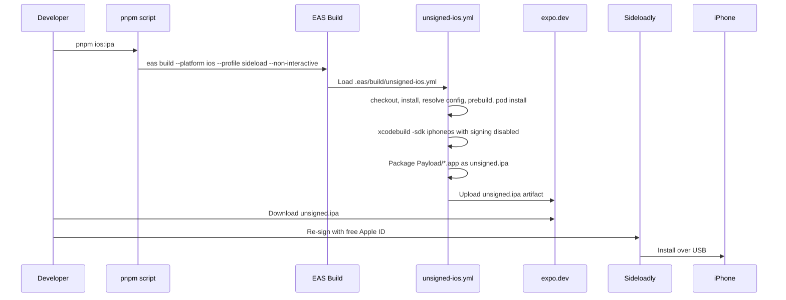

# Module: eas-sideload

## Business Context

### Module Purpose

The `eas-sideload` module enables physical iPhone testing from this Expo project without a paid Apple Developer Program account. It produces an unsigned device `.ipa` through EAS Build, then relies on a local sideloading tool to re-sign and install that artifact with a free Apple ID.

The current decision is documented in ADR [docs/_decisions/0003-unsigned-ipa-custom-build.md](_decisions/0003-unsigned-ipa-custom-build.md). The operator walkthrough is [docs/_howto/sideload-iphone.md](_howto/sideload-iphone.md).

### Business Scenarios

- A Windows-first developer needs to test the standalone Expo app on a physical iPhone.
- The project needs a device `.ipa`, not only Expo Go or an iOS Simulator artifact.
- The developer wants to keep the Apple Developer Program optional for personal testing.
- The same unsigned artifact can be re-signed locally when the free Apple ID certificate expires.

### Domain Concepts

- **Sideload profile**: The `eas.json` build profile named `sideload`, invoked by `pnpm ios:ipa`.
- **Custom EAS build YAML**: `.eas/build/unsigned-ios.yml`, selected by `ios.config: "unsigned-ios.yml"`.
- **Unsigned IPA**: A device build packaged as `unsigned.ipa` with Xcode code signing disabled.
- **Local re-signing**: Sideloadly or a similar tool applies a free Apple ID signing identity outside EAS.
- **Free Apple ID constraints**: Apps expire after 7 days, a free Apple ID is limited to 3 active sideloaded apps, and entitled services such as push notifications, iCloud, and Sign in with Apple are unavailable. See the how-to and ADR for operational detail.

### Use Cases

1. **Build an unsigned physical-device IPA**: `pnpm ios:ipa` runs `eas build --platform ios --profile sideload --non-interactive`.
2. **Build a simulator artifact**: `pnpm ios:simulator` runs `eas build --platform ios --profile development --non-interactive` for the `development` profile with `ios.simulator: true`.
3. **Re-sign and install on iPhone**: Download `unsigned.ipa` from EAS, then follow [docs/_howto/sideload-iphone.md](_howto/sideload-iphone.md).
4. **Understand the build decision**: Read ADR [docs/_decisions/0003-unsigned-ipa-custom-build.md](_decisions/0003-unsigned-ipa-custom-build.md) before changing the build profile or YAML.

### Business Rules

- Physical-device sideload builds must use the `sideload` profile, not the simulator-oriented `development` profile.
- `withoutCredentials: true` alone is not enough for a non-simulator iOS EAS build. It suppresses the local CLI credential prompt, but the standard remote pipeline still attempts Apple credential restore.
- The custom YAML is required because it replaces the standard credentialed EAS iOS pipeline with explicit unsigned build steps.
- The unsigned EAS artifact is not installable as-is. It must be re-signed locally before installation.
- The iOS bundle identifier in this project is `com.izkizk8.spot`.

## Technical Overview

### Module Type

Configuration, custom cloud build workflow, and generated documentation. This module does not add runtime application code.

### Key Technologies

- **Expo SDK**: `~55.0.17` from `package.json`.
- **EAS Build**: Remote macOS build service selected through `eas.json`.
- **EAS CLI requirement**: `>= 15.0.0` from `eas.json`.
- **Native build tool**: `xcodebuild`, executed on the EAS macOS worker.
- **Dependency install**: `eas/install_node_modules` and `pod install` after prebuild.
- **Local install tool**: Sideloadly, with iTunes for Windows for USB transport per the how-to.

### Module Structure

```text
.eas/
└── build/
    └── unsigned-ios.yml
eas.json
package.json
app.json
docs/
├── eas-sideload_profile.md
├── _index/
│   └── eas-sideload_fileindex.json
├── _decisions/
│   └── 0003-unsigned-ipa-custom-build.md
└── _howto/
    └── sideload-iphone.md
```

## Components

### Developer Commands

**File**: `package.json`

| Script | Command | Purpose |
|--------|---------|---------|
| `ios:ipa` | `eas build --platform ios --profile sideload --non-interactive` | Builds the unsigned physical-device IPA through the sideload profile. |
| `ios:simulator` | `eas build --platform ios --profile development --non-interactive` | Builds the iOS Simulator artifact through the development profile. |

### EAS Build Profiles

**File**: `eas.json`

| Profile | iOS settings | Purpose |
|---------|--------------|---------|
| `development` | `simulator: true` | Simulator build, not installable on physical devices. |
| `sideload` | `withoutCredentials: true`, `simulator: false`, `config: "unsigned-ios.yml"` | Unsigned physical-device IPA build. |
| `production` | Empty profile | Placeholder for normal signed production build configuration. |

The `sideload` profile deliberately combines `withoutCredentials: true` with the custom YAML. The custom YAML is the part that avoids the remote credential restore path.

### Custom Build Workflow

**File**: `.eas/build/unsigned-ios.yml`

| Step | Responsibility |
|------|----------------|
| `eas/checkout` | Check out the project on the EAS worker. |
| `eas/install_node_modules` | Install JavaScript dependencies. |
| `eas/resolve_build_config` | Resolve EAS build configuration. |
| `eas/prebuild` | Generate the native `ios/` project from the Expo app config. |
| `pod install` | Install CocoaPods dependencies in `./ios`. |
| `Build unsigned IPA` | Detect the Xcode scheme, run `xcodebuild` for `iphoneos` with signing disabled, copy the `.app` into `Payload/`, and zip `unsigned.ipa`. |
| `eas/upload_artifact` | Upload `unsigned.ipa` as the EAS build artifact. |

The workflow explicitly sets `CODE_SIGNING_REQUIRED=NO`, `CODE_SIGNING_ALLOWED=NO`, `CODE_SIGN_IDENTITY=""`, and `CODE_SIGN_ENTITLEMENTS=""`. It does not call an Apple credential configuration step.

### App Configuration

**File**: `app.json`

- `expo.name`: `spot`
- `expo.slug`: `spot`
- `expo.ios.bundleIdentifier`: `com.izkizk8.spot`
- `expo.ios.infoPlist.ITSAppUsesNonExemptEncryption`: `false`
- `expo.extra.eas.projectId`: `1fba2bd5-bb88-48d5-b57d-a9a4e9fe6a4e`

### Decision and Operator Documentation

| File | Role |
|------|------|
| [docs/_decisions/0003-unsigned-ipa-custom-build.md](_decisions/0003-unsigned-ipa-custom-build.md) | Records why the custom EAS build YAML is required and which alternatives were rejected. |
| [docs/_howto/sideload-iphone.md](_howto/sideload-iphone.md) | Documents the operator steps for building, downloading, re-signing, trusting, and re-signing again after expiry. |

## Workflow

### Request Flow



### Data Flow

1. `package.json` exposes `pnpm ios:ipa` as the human entry point.
2. `eas.json` resolves the `sideload` profile and points iOS builds to `unsigned-ios.yml`.
3. `app.json` supplies the Expo app identity, including `com.izkizk8.spot`.
4. `eas/prebuild` creates the native iOS project on the EAS worker.
5. `xcodebuild` creates an unsigned Release `.app` for `iphoneos`.
6. The workflow packages `Payload/*.app` into `unsigned.ipa` and uploads it.
7. Local tooling re-signs and installs the artifact according to [docs/_howto/sideload-iphone.md](_howto/sideload-iphone.md).

### Credential Flow

EAS does not receive Apple credentials for the sideload build. Free Apple ID credentials are entered only into the local sideloading tool described by the how-to.

## API Documentation

This module exposes no HTTP or native API surface. Its public interface is the package script catalog and EAS build profile names.

### API Summary Table

| Interface | Input | Output |
|-----------|-------|--------|
| `pnpm ios:ipa` | Current Expo project checkout | EAS `sideload` build producing `unsigned.ipa` |
| `pnpm ios:simulator` | Current Expo project checkout | EAS `development` simulator build |

## Data Model

This module has no persisted runtime data model. Its data model is declarative build configuration.

| Source | Key | Current Value | Meaning |
|--------|-----|---------------|---------|
| `eas.json` | `cli.version` | `>= 15.0.0` | Minimum EAS CLI version. |
| `eas.json` | `cli.appVersionSource` | `remote` | Version source managed by EAS. |
| `eas.json` | `build.development.ios.simulator` | `true` | Development builds target iOS Simulator. |
| `eas.json` | `build.sideload.ios.withoutCredentials` | `true` | Skip local credential prompt, but not sufficient by itself. |
| `eas.json` | `build.sideload.ios.simulator` | `false` | Produce a physical-device build. |
| `eas.json` | `build.sideload.ios.config` | `unsigned-ios.yml` | Select the custom build YAML. |
| `package.json` | `scripts.ios:ipa` | `eas build --platform ios --profile sideload --non-interactive` | Developer command for unsigned IPA builds. |
| `package.json` | `scripts.ios:simulator` | `eas build --platform ios --profile development --non-interactive` | Developer command for simulator builds. |
| `app.json` | `expo.ios.bundleIdentifier` | `com.izkizk8.spot` | iOS app identifier. |

## Dependencies

### Internal Dependencies

- `package.json` depends on `eas.json` profile names remaining stable.
- `eas.json` depends on `.eas/build/unsigned-ios.yml` existing under `.eas/build/`.
- `.eas/build/unsigned-ios.yml` depends on Expo prebuild generating an iOS workspace named `spot.xcworkspace`.
- `app.json` supplies the app identity consumed during prebuild.
- ADR [docs/_decisions/0003-unsigned-ipa-custom-build.md](_decisions/0003-unsigned-ipa-custom-build.md) is the rationale source for future changes.
- How-to [docs/_howto/sideload-iphone.md](_howto/sideload-iphone.md) is the operator source for local re-signing steps.

### External Services and Tools

| Dependency | Required For | Notes |
|------------|--------------|-------|
| EAS Build | Remote iOS build | Produces the unsigned `.ipa` artifact. |
| expo.dev dashboard | Artifact retrieval | Used to download the generated IPA. |
| EAS CLI | Command execution | Required version is `>= 15.0.0`. |
| Xcode / `xcodebuild` | Native iOS compilation | Provided by the EAS macOS build worker. |
| CocoaPods | Native dependency install | Run by the custom YAML after prebuild. |
| Sideloadly | Local re-sign and install | Covered by the how-to. |
| iTunes for Windows | USB device communication | Required by the Windows sideload flow in the how-to. |
| Free Apple ID | Local signing | Subject to the free account limitations documented in the how-to and ADR. |

### Configuration Requirements

| Requirement | Required | Source |
|-------------|----------|--------|
| EAS project linked to this Expo app | Yes | `app.json` `expo.extra.eas.projectId` |
| `sideload` EAS profile | Yes | `eas.json` |
| Custom unsigned build YAML | Yes | `.eas/build/unsigned-ios.yml` |
| Stable iOS bundle identifier | Yes | `app.json` |
| Local sideloading setup | Yes for install | [docs/_howto/sideload-iphone.md](_howto/sideload-iphone.md) |

## File Organization

### Component Distribution

- Entry points: 2 files (`package.json`, `eas.json`)
- Custom build workflow: 1 file (`.eas/build/unsigned-ios.yml`)
- App configuration: 1 file (`app.json`)
- Curated decision/how-to documentation: 2 files
- Generated module documentation: 2 files
- Runtime application source files: 0 files in this module

### Key Files

1. **`.eas/build/unsigned-ios.yml`**: Defines the custom unsigned iOS build workflow and disables Xcode signing.
2. **`eas.json`**: Connects the `sideload` profile to the custom YAML.
3. **`package.json`**: Exposes `pnpm ios:ipa` and `pnpm ios:simulator`.
4. **`app.json`**: Defines the `com.izkizk8.spot` bundle identifier used during prebuild.
5. **[docs/_decisions/0003-unsigned-ipa-custom-build.md](_decisions/0003-unsigned-ipa-custom-build.md)**: Stores the accepted architectural decision.
6. **[docs/_howto/sideload-iphone.md](_howto/sideload-iphone.md)**: Stores the install and re-signing procedure.

## Quality Observations

### Strengths

- The user-facing command is simple: `pnpm ios:ipa`.
- The custom build YAML keeps Apple credentials out of EAS for this sideload flow.
- The decision record explains why `withoutCredentials: true` is insufficient by itself.
- Operational details live in the how-to, keeping this generated profile focused on module structure.
- The EAS remote build is kept outside the local `pnpm check` quality gate, avoiding accidental quota usage.

### Concerns

- `.eas/build/unsigned-ios.yml` hardcodes `spot.xcworkspace`; a future app slug/workspace rename must update the YAML.
- Custom EAS build behavior should be revalidated on EAS major upgrades or custom-build schema changes.
- Free Apple ID installs are temporary and limited; the how-to and ADR should remain the source for those operational facts.
- The `production` profile is currently empty, so signed App Store/TestFlight behavior is intentionally outside this module.

### Recommendations

- Keep ADR 0003 and the how-to curated by hand; regenerate this profile when the scripts, build profiles, bundle identifier, or custom YAML change.
- If Expo/EAS adds a first-class unsigned iOS build mode, revisit ADR 0003 before changing `unsigned-ios.yml`.
- If the project is renamed, verify the Xcode workspace name in the custom YAML during the next `pnpm ios:ipa` build.

## Testing

### Verification Surface

- Static verification: parse `docs/_index/eas-sideload_fileindex.json` as JSON.
- Configuration verification: inspect `eas.json`, `package.json`, `app.json`, and `.eas/build/unsigned-ios.yml` together.
- End-to-end build verification: run `pnpm ios:ipa`, download the EAS artifact, then follow [docs/_howto/sideload-iphone.md](_howto/sideload-iphone.md).

### Test Gaps

- No automated local test can prove the EAS remote build succeeds without consuming EAS quota.
- No automated test validates Sideloadly installation on a physical iPhone.

## Performance Considerations

- `pnpm ios:ipa` starts a remote EAS build and should not be part of local quality gates.
- Build duration and free-plan quota are operational concerns documented in the how-to and ADR.
- Re-signing the same `unsigned.ipa` avoids unnecessary rebuilds when only the free Apple ID certificate expires.

---

**Generated**: 2026-04-28
**Module Path**: `eas.json` + `.eas/build/unsigned-ios.yml` + `package.json` scripts + `app.json` + [docs/_decisions/0003-unsigned-ipa-custom-build.md](_decisions/0003-unsigned-ipa-custom-build.md) + [docs/_howto/sideload-iphone.md](_howto/sideload-iphone.md)
