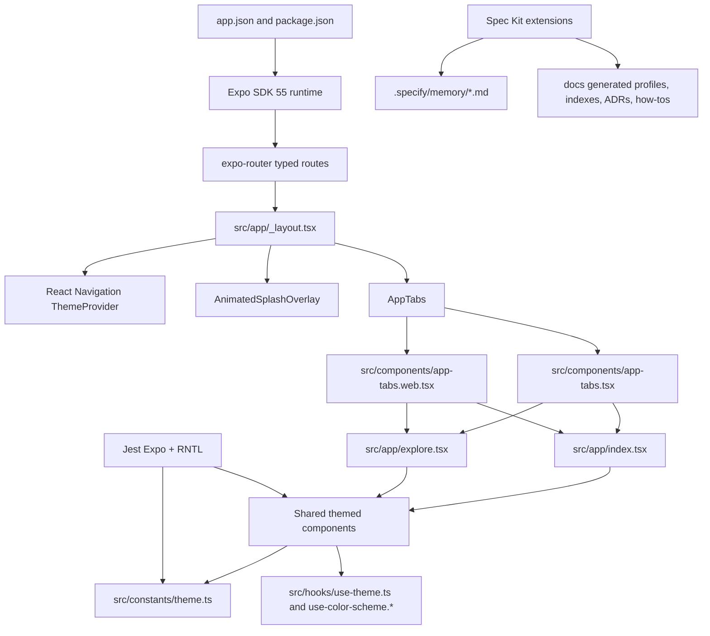

# spot

## Introduction

spot is a universal Expo application targeting iOS, Android, and web from one React Native codebase. The current app is still close to the Expo starter surface, but the repository has a mature agent-first development layer around Spec Kit, generated documentation, automated documentation checks, strict TypeScript, React Compiler, and a local quality gate.

The application entry point is `expo-router/entry`. Routes live under `src/app/`, shared UI lives under `src/components/`, design tokens live in `src/constants/theme.ts`, and tests live under `test/unit/`.

## Project Architecture

### Technology Stack

| Area | Current choice |
|------|----------------|
| Runtime | Expo SDK 55 (`expo@~55.0.17`) |
| React stack | React 19.2.0, React Native 0.83.6, React DOM 19.2.0, React Native Web 0.21 |
| Routing | `expo-router@~55.0.13` with typed routes enabled in `app.json` |
| Compiler | React Compiler enabled with `experiments.reactCompiler: true` |
| Language | TypeScript 5.9 in strict mode |
| Package manager | pnpm with `nodeLinker: hoisted` |
| Styling | React Native `StyleSheet.create()`, centralized tokens in `src/constants/theme.ts`, `ThemedText`, `ThemedView`, and `useTheme()` |
| Platform split | `.web.tsx` / `.web.ts` suffixes for non-trivial web differences |
| Animation | `react-native-reanimated` and `react-native-worklets` |
| Images and symbols | `expo-image` and `expo-symbols` |
| Formatting | OXC formatter (`oxfmt@0.46.0`) |
| Linting | OXC lint (`oxlint@1.61.0`) plus official `eslint-plugin-react-hooks@7.1.1` through ESLint 10 |
| Type checks | `tsc --noEmit` |
| Unit tests | Jest 29, `jest-expo@55.0.16`, and React Native Testing Library |
| Builds | EAS CLI >= 15, with development, sideload, and production profiles in `eas.json` |

### Module Structure

```text
src/
  app/
    _layout.tsx       Root layout, React Navigation theme provider, splash overlay, tab shell
    index.tsx         Home route
    explore.tsx       Explore route with collapsible Expo starter content
  components/
    app-tabs.tsx      Native tab implementation using expo-router unstable NativeTabs
    app-tabs.web.tsx  Web tab implementation using expo-router/ui
    themed-text.tsx   Theme-aware text primitive
    themed-view.tsx   Theme-aware view primitive
    animated-icon.*   Native/web animated splash and icon variants
    ui/               Shared UI primitives such as Collapsible
  constants/
    theme.ts          Colors, fonts, spacing scale, max width, tab inset constants
  hooks/
    use-theme.ts      Active color palette helper
    use-color-scheme.* Native/web color scheme hooks

test/
  setup.ts            Shared Jest Expo mocks
  unit/examples/      Copyable examples for TS logic, RN rendering, aliases, and mocks

specs/
  NNN-feature/        Spec Kit feature specs, plans, tasks, quickstarts, and checklists

docs/
  README.md           Curated documentation index and doc-system rules
  overview.md         This generated repository overview
  architecture.md     Generated architecture profile
  *_profile.md        Explicit generated module profiles listed in docs/README.md
  sdd-extensions.md   Registry-derived Spec Kit extension catalog reference
  _index/*.json       Generated machine-readable file indexes
  _decisions/         ADRs for human judgement and tradeoffs
  _howto/             External-tool walkthroughs and manual procedures

.specify/
  extensions/         Enabled Spec Kit extensions
  memory/             Project governance files loaded by memory-loader
  templates/          Spec Kit templates

.eas/build/
  unsigned-ios.yml    Custom unsigned iOS IPA build pipeline
```

### Architecture Diagram



### Key Components

- `src/app/_layout.tsx` mounts the navigation theme, animated splash overlay, and tab navigator.
- `src/components/app-tabs.tsx` is the native tab shell. It uses `expo-router/unstable-native-tabs` and image assets under `assets/images/tabIcons/`.
- `src/components/app-tabs.web.tsx` is the web tab shell. It uses `expo-router/ui` primitives and adds a compact web navigation bar.
- `src/components/themed-text.tsx` and `src/components/themed-view.tsx` are the default primitives for text and surfaces.
- `src/constants/theme.ts` owns light/dark colors, font choices, the `Spacing` scale, `BottomTabInset`, and `MaxContentWidth`.
- `test/setup.ts` centralizes shared Jest mocks for global CSS, Expo font loading, Expo image, and Reanimated.

## Tooling And Quality Gates

Detailed tooling documentation lives in [docs/tooling_profile.md](tooling_profile.md), with its generated file index at [docs/_index/tooling_fileindex.json](_index/tooling_fileindex.json).

### Package Scripts

| Task | Command |
|------|---------|
| Install dependencies | `pnpm install` |
| Metro dev server | `pnpm start` |
| Android target | `pnpm android` |
| iOS target | `pnpm ios` |
| Web target | `pnpm web` |
| Unsigned iOS IPA | `pnpm ios:ipa` |
| iOS simulator EAS build | `pnpm ios:simulator` |
| Format | `pnpm format` |
| Check formatting | `pnpm format:check` |
| OXC lint | `pnpm lint:ox` |
| Official React Hooks lint | `pnpm lint:hooks` |
| Full lint | `pnpm lint` |
| Documentation gate | `pnpm docs:check` |
| Type check | `pnpm typecheck` |
| Unit tests | `pnpm test` |
| Watch tests | `pnpm test:watch` |
| Local quality gate | `pnpm check` |

`pnpm check` runs formatting check, OXC lint, official React Hooks lint, documentation checks, strict TypeScript, and Jest unit tests. Remote EAS builds are intentionally separate because they consume cloud build resources.

### Lint, Format, Typecheck, Test

- `oxfmt` is configured by `.oxfmtrc.json` and ignores generated or external areas such as `.specify/`, `.github/`, `docs/`, `specs/`, assets, lockfiles, and build outputs.
- `oxlint` is configured by `oxlint.json` with TypeScript, Unicorn, OXC, React, Jest, and import plugins. Correctness and suspicious categories are errors.
- `eslint.config.js` keeps the official `eslint-plugin-react-hooks` flat recommended config and raises `react-hooks/exhaustive-deps` to error. This is the source-of-truth Hooks check for React Compiler-era rules.
- `tsconfig.json` extends `expo/tsconfig.base`, enables `strict: true`, and maps `@/*` to `./src/*` plus `@/assets/*` to `./assets/*`.
- `jest.config.js` uses the `jest-expo` preset, maps the same aliases, includes CSS style mocks, and targets `test/unit/**/*.test.ts(x)`.

## Spec Kit And Agent Workflow

This repository uses Spec Kit as the structured development lifecycle: specify -> clarify -> plan -> tasks -> analyze -> implement -> verify. The workspace currently has 22 enabled Spec Kit extension registrations in `.specify/extensions/.registry`, including `git`, `memory-loader`, `repoindex`, `archive`, `retrospective`, `status`, `doctor`, `superb`, `status-report`, `spec-validate`, `agent-assign`, `bugfix`, `catalog-ci`, `cleanup`, `fix-findings`, `fleet`, `learn`, `plan-review-gate`, `retro`, `review`, `orchestrator`, and `checkpoint`.

`memory-loader` is enabled before the lifecycle commands and loads these governance files:

- `.specify/memory/constitution.md`
- `.specify/memory/doc-system.md`
- `.specify/memory/spec.md`
- `.specify/memory/plan.md`
- `.specify/memory/changelog.md`

The current constitution is version 1.1.0. It requires cross-platform parity, token-based theming, platform file splitting, `StyleSheet.create()` discipline, test-first behavior for new app features, and validate-before-spec proof for build or infrastructure work.

## Documentation System

The documentation system is intentionally classed by source of truth:

| Class | Path | Source of truth | Update rule |
|-------|------|-----------------|-------------|
| Curated docs index | `docs/README.md` | Documentation system policy | Hand-edit when the doc map or rules change |
| Generated profiles | Explicit root files listed in `docs/README.md` | Code and configuration scan | Re-run the matching `/speckit.repoindex.*` command; machine-written |
| Registry-derived references | Explicit root files listed in `docs/README.md` | Local registry and manifests | Refresh from source data and verify with `pnpm docs:check` |
| File indexes | `docs/_index/*.json` | Code scan | Generated alongside repoindex module passes |
| Decisions | `docs/_decisions/NNNN-*.md` | Human judgement and tradeoffs | Add or update ADRs with the decision template |
| How-tos | `docs/_howto/*.md` | External tools and manual procedures | Add or update walkthroughs with the how-to template |

Practical rule: if the information is derivable from code, regenerate the relevant profile. If it is a decision, put it in an ADR. If it is an external-tool walkthrough, put it in a how-to. Generic notes do not belong in `docs/`.

Current generated profiles are the explicit files named in the Generated Profiles table of `docs/README.md`: this overview, `architecture.md`, `speckit_profile.md`, `eas-sideload_profile.md`, and `tooling_profile.md`.

`sdd-extensions.md` is a registry-derived reference checked against `.specify/extensions/.registry` and extension manifests. `docs/README.md` is the curated documentation index, not a generated profile. Companion JSON indexes live under `docs/_index/`, including `tooling_fileindex.json` for the tooling profile.

## Configuration Reference

| File | Purpose |
|------|---------|
| `package.json` | Expo entry point, package scripts, runtime dependencies, dev dependencies |
| `app.json` | Expo app metadata, typed routes, React Compiler, plugins, bundle ID, EAS project ID |
| `tsconfig.json` | Strict TypeScript and path aliases |
| `pnpm-workspace.yaml` | Hoisted pnpm linker required by the Expo workspace setup |
| `.oxfmtrc.json` | OXC formatter behavior and ignore list |
| `oxlint.json` | OXC lint plugins, categories, environments, and rules |
| `eslint.config.js` | Official React Hooks ESLint config |
| `jest.config.js` | Jest Expo preset, setup file, test globs, alias mapping, transform exceptions |
| `eas.json` | EAS CLI version and build profiles |
| `.eas/build/unsigned-ios.yml` | Custom unsigned iOS IPA build steps |
| `.specify/extensions.yml` | Lifecycle hook wiring |
| `.specify/extensions/.registry` | Enabled extension registry and command registration metadata |

## Getting Started

### Prerequisites

- Node.js and pnpm available locally.
- Expo-compatible native toolchain for iOS or Android simulator work.
- EAS CLI >= 15 for cloud build commands such as `pnpm ios:ipa`.

### Local Development Setup

```bash
pnpm install
pnpm start
```

After Metro starts, launch a platform target:

```bash
pnpm ios
pnpm android
pnpm web
```

### Local Verification

```bash
pnpm check
```

For focused runs:

```bash
pnpm format:check
pnpm lint
pnpm docs:check
pnpm typecheck
pnpm test
```

### EAS Builds

`eas.json` defines three profiles:

| Profile | Purpose |
|---------|---------|
| `development` | iOS simulator build with no device credentials |
| `sideload` | Unsigned iOS device IPA using `.eas/build/unsigned-ios.yml` |
| `production` | Placeholder for future signed production builds |

The `sideload` profile uses `withoutCredentials: true` and the custom YAML pipeline to skip Apple credential preparation, build with code signing disabled, package `Payload/*.app`, and upload `unsigned.ipa` as the artifact.

## Additional Resources

- [README.md](../README.md)
- [docs/README.md](README.md)
- [docs/architecture.md](architecture.md)
- [docs/speckit_profile.md](speckit_profile.md)
- [docs/sdd-extensions.md](sdd-extensions.md)
- [docs/eas-sideload_profile.md](eas-sideload_profile.md)
- [docs/tooling_profile.md](tooling_profile.md)
- [docs/_index/tooling_fileindex.json](_index/tooling_fileindex.json)
- [docs/_decisions/README.md](_decisions/README.md)
- [docs/_howto/README.md](_howto/README.md)
- [docs/_howto/sideload-iphone.md](_howto/sideload-iphone.md)

---

**Generated**: 2026-04-28 by repoindex v1.0.0
