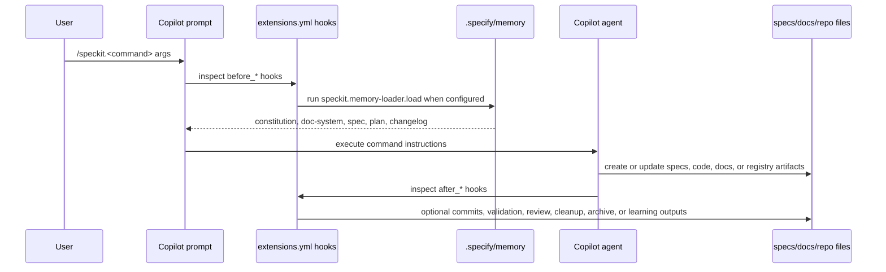
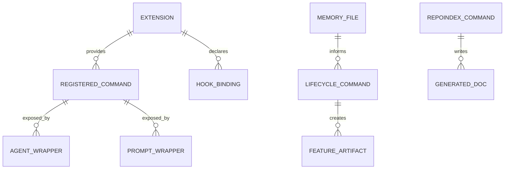

# Module: speckit

## Business Context

### Module Purpose

The `speckit` module is the Specification-Driven Development operating layer for this workspace. It turns feature work into a governed lifecycle: specify, clarify, plan, tasks, analyze, implement, verify, and archive. It exposes that lifecycle through GitHub Copilot agents, prompts, local Spec Kit configuration, installed extensions, durable memory, and generated documentation.

The module is not application runtime code. It is the agent-facing workflow system that keeps feature artifacts, project memory, quality gates, and documentation aligned for the Expo app.

### AI-First Operating Model

Spec Kit is the core lifecycle and traceability spine. Spec Kit extensions are the capability layer around that spine: repo indexing, validation, review, cleanup, orchestration, checkpoints, status, and bugfix workflows. Superpowers, Context Engineering, and RUG are plugin accelerators that improve how individual phases are planned, executed, and verified without replacing Spec Kit artifacts.

| Layer | Role | Durable record |
|-------|------|----------------|
| Spec Kit core | Owns phase order and feature artifacts | `specs/`, `.specify/memory/`, generated docs |
| Spec Kit extensions | Add lifecycle capabilities and checks | `.specify/extensions/`, `.specify/extensions.yml`, [sdd-extensions.md](sdd-extensions.md) |
| Superpowers | Adds engineering discipline | Skill invocation evidence, tests, verification output |
| Context Engineering | Maps multi-file impact before edits | Plans/specs and touched-file rationale |
| RUG / SWE / QA | Delegates and validates large work | Tasks, implementation diffs, QA findings |

### Business Scenarios

- Start a new feature from a natural-language request and create the matching `specs/NNN-feature-name/` artifacts.
- Preserve project governance by loading `.specify/memory/*.md` before lifecycle commands.
- Gate plans and implementations with the constitution, validation extensions, TDD/review bridges, and post-implementation verification.
- Regenerate code-derived documentation after the Spec Kit or documentation surface changes.
- Archive completed feature knowledge into durable project memory after merge.
- Coordinate larger development flows through orchestration, assignment, review, cleanup, and retrospective extensions.

### Domain Concepts

| Concept | Source | Purpose |
|---------|--------|---------|
| Constitution | `.specify/memory/constitution.md` | Project governance. Current source version is `1.1.0`. |
| Durable memory | `.specify/memory/{constitution,doc-system,spec,plan,changelog}.md` | Project facts loaded before lifecycle commands. |
| Lifecycle command | `.github/agents/*.agent.md` and `.github/prompts/*.prompt.md` | Copilot-facing command wrappers for Spec Kit phases and extensions. |
| Extension manifest | `.specify/extensions/*/extension.yml` | Declares extension metadata, commands, aliases, hooks, config, tags, and required tools. |
| Extension registry | `.specify/extensions/.registry` | Installed extension database with versions, enabled state, hashes, registered commands, and install timestamps. |
| Hook configuration | `.specify/extensions.yml` | Runtime hook map for `before_*` and `after_*` lifecycle events. |
| Generated root document set | Explicit files listed in `docs/README.md` | Code-derived documentation maintained by repoindex commands; `docs/README.md` is curated and is not itself generated. |
| File index | `docs/_index/*.json` | Machine-readable companion index for generated module profiles. |
| Plugin accelerator | Superpowers, Context Engineering, and RUG/SWE/QA | Discipline, planning, and delegation layers that support the Spec Kit lifecycle. |

### Use Cases

1. **Feature lifecycle execution**: Use `/speckit.specify`, `/speckit.plan`, `/speckit.tasks`, and `/speckit.implement` to move from request to code with review gates.
2. **Project context loading**: Run lifecycle commands with memory-loader hooks so constitution, documentation rules, durable requirements, plans, and changelog context are present.
3. **Extension-backed governance**: Use registered extensions for git workflow, validation, review, cleanup, bugfix traceability, retrospectives, and orchestration.
4. **Documentation regeneration**: Run `/speckit.repoindex.module "speckit"` after extension installs/removals, hook changes, constitution changes, or agent-stack policy changes to refresh this profile, [sdd-extensions.md](sdd-extensions.md), and [_index/speckit_fileindex.json](_index/speckit_fileindex.json).
5. **Post-merge knowledge capture**: Archive completed feature artifacts into durable memory through the archive extension.

## Technical Overview

### Module Type

Agent workflow and documentation subsystem. It is made of Markdown prompts/agents, YAML manifests, JSON registries, PowerShell/Bash scripts, Spec Kit templates, durable memory files, and generated documentation.

### Key Technologies

| Technology | Version / source | Role |
|------------|------------------|------|
| Spec Kit / Specify CLI | `0.8.1.dev0` in `.specify/init-options.json` and `.specify/integration.json` | SDD lifecycle engine |
| GitHub Copilot integration | `.github/agents/`, `.github/prompts/` | Agent and prompt wrappers for commands |
| YAML | `.specify/extensions.yml`, `.specify/extensions/*/extension.yml` | Extension manifests and hook configuration |
| JSON | `.specify/extensions/.registry`, integration manifests, file indexes | Registry and machine-readable metadata |
| PowerShell / Bash | `.specify/scripts/`, extension script folders | Local automation for prerequisites, feature creation, git, status, validation, and review helpers |
| Markdown | specs, memory, prompts, docs | Human-readable workflow artifacts |

### Module Structure

```text
.specify/
  extensions.yml                  Hook configuration
  extensions/.registry            Installed extension registry
  extensions/*/extension.yml       Extension manifests
  extensions/*/commands/*.md       Extension command bodies
  memory/*.md                      Durable project memory loaded by memory-loader
  scripts/powershell/*.ps1         Core Spec Kit helper scripts
  templates/*.md                   Constitution/spec/plan/tasks/checklist templates
  workflows/                       Full SDD workflow definition
.github/
  agents/*.agent.md                Copilot agent wrappers
  prompts/*.prompt.md              Copilot prompt wrappers
.agents/skills/
  speckit*/SKILL.md                Command-specific skills for installed extensions
docs/
  README.md                         Curated docs index and explicit generated-output list
  speckit_profile.md               This generated module profile
  sdd-extensions.md                Registry-derived extension reference
  _index/speckit_fileindex.json    Machine-readable module file index
```

## Components

### Entry Points

| Entry point | Responsibility |
|-------------|----------------|
| `.github/prompts/speckit.*.prompt.md` | User-invoked slash command prompt wrappers. |
| `.github/agents/speckit.*.agent.md` | Copilot agent definitions bound to command behavior. |
| `.specify/workflows/speckit/workflow.yml` | Bundled full SDD workflow: specify -> plan -> tasks -> implement with review gates. |
| `.specify/scripts/powershell/create-new-feature.ps1` | Core feature directory and branch helper used by lifecycle commands. |

### Command Handlers

The module exposes command handlers as Markdown instruction files rather than HTTP controllers. There are 71 Copilot agent wrappers and 71 prompt wrappers in the workspace. They cover 9 core SDD lifecycle commands plus installed extension commands and selected aliases.

Core command families:

| Family | Commands |
|--------|----------|
| Lifecycle | `speckit.constitution`, `speckit.specify`, `speckit.clarify`, `speckit.plan`, `speckit.tasks`, `speckit.implement` |
| Validation and analysis | `speckit.checklist`, `speckit.analyze`, `speckit.taskstoissues` |
| Documentation | `speckit.repoindex.overview`, `speckit.repoindex.architecture`, `speckit.repoindex.module` |
| Extension commands | Full registry-derived list in [sdd-extensions.md](sdd-extensions.md). |

### Services

| Service | Files | Responsibility |
|---------|-------|----------------|
| Hook executor configuration | `.specify/extensions.yml` | Declares enabled pre/post lifecycle hooks, optionality, prompts, and command bindings. |
| Memory loader | `.specify/extensions/memory-loader/extension.yml` and `speckit.memory-loader.load` wrappers | Reads all `.specify/memory/*.md` files before configured lifecycle phases. |
| Git workflow | `.specify/extensions/git/extension.yml`, git scripts | Branch creation, branch validation, remote detection, initialization, and optional auto-commit hooks. |
| Repo indexer | `.specify/extensions/repoindex/extension.yml`, repoindex command files | Generates code-derived docs and JSON file indexes. |
| Quality gates | superb, spec-validate, review, cleanup, fix-findings, bugfix manifests and wrappers | Adds TDD, validation, review, verification, cleanup, finding resolution, and bugfix consistency checks. |
| Orchestration | fleet, orchestrator, agent-assign manifests and wrappers | Coordinates full lifecycle runs, multi-feature visibility, and task-to-agent assignment. |

### Repositories / Data Access

There is no database repository layer. The module reads and writes local artifact repositories:

| Artifact repository | Purpose |
|---------------------|---------|
| `.specify/extensions/.registry` | Installed extension metadata and registered command targets. |
| `.specify/extensions.yml` | Hook registration and execution configuration. |
| `.specify/memory/*.md` | Durable project memory loaded into command context. |
| `specs/` | Per-feature specifications, plans, tasks, checklists, research, retrospectives, and memory synthesis. |
| `docs/` | Curated docs index, explicit generated root documents, generated file indexes, ADRs, and how-tos under documented classes. |

### Models / Entities

| Entity | Fields / structure | Lifecycle |
|--------|--------------------|-----------|
| Extension | `id`, `name`, `version`, `description`, `author`, `repository`, `license`, `provides.commands`, `hooks`, `tags` | Declared in `extension.yml`, registered in `.registry`. |
| Registered command | command name, integration target list, aliases where applicable | Stored under `.registry.extensions[*].registered_commands`. |
| Hook binding | hook phase, extension id, command, enabled, optional, prompt, description, condition | Stored in `.specify/extensions.yml`. |
| Memory file | Markdown content loaded before lifecycle commands | Maintained by archive/doc-system processes and project governance. |
| Feature artifact | `spec.md`, `plan.md`, `tasks.md`, optional design/checklist/retrospective files | Created and updated across the SDD lifecycle. |
| Generated file index | module metadata, component groups, paths, purposes, responsibilities, dependencies | Written by `repoindex.module` to `docs/_index/*.json`. |

### Configuration

| File | Owns |
|------|------|
| `.specify/init-options.json` | AI integration, branch numbering, context file, script flavor, Spec Kit version. |
| `.specify/integration.json` | Active integration and integration version. |
| `.specify/extensions/.registry` | Installed/enabled extension set and registered command entries. |
| `.specify/extensions.yml` | Lifecycle hook bindings. The top-level `installed` list is empty; active installed state is recorded in `.registry`. |
| `.specify/workflows/workflow-registry.json` | Installed workflow registry. |
| `.specify/workflows/speckit/workflow.yml` | Full SDD workflow definition. |
| `.specify/templates/*.md` | Core artifact templates. |
| `.specify/memory/doc-system.md` | Documentation class rules and hook reminders. |

### Utilities

| Utility area | Files | Purpose |
|--------------|-------|---------|
| Core scripts | `.specify/scripts/powershell/*.ps1` | Prerequisite checks, shared helpers, feature setup, plan setup. |
| Extension scripts | `.specify/extensions/*/scripts/{bash,powershell}/*` | Git, status, doctor, validation, superb status sync, and review changed-file helpers. |
| Config templates | `.specify/extensions/*/*template*.yml` | Optional extension configuration templates. |

## Workflow

### Request Flow



### Data Flow

1. User input enters through a `.github/prompts/speckit.*.prompt.md` slash-command wrapper.
2. The prompt reads `.specify/extensions.yml` and surfaces executable `before_*` hooks.
3. `speckit.memory-loader.load` loads `.specify/memory/constitution.md`, `.specify/memory/doc-system.md`, `.specify/memory/spec.md`, `.specify/memory/plan.md`, and `.specify/memory/changelog.md` before configured lifecycle commands.
4. The selected Copilot agent applies command-specific instructions against templates, specs, code, docs, or extension metadata.
5. `after_*` hooks may offer commits, validation, review, retrospectives, cleanup, finding resolution, learning guides, or bugfix consistency checks.
6. Repoindex outputs only the explicit generated root documents listed in `docs/README.md` plus companion JSON indexes under `docs/_index/`.

### Hook Mechanism

`.specify/memory/doc-system.md` is part of the memory-loader payload. Because memory-loader is configured as a required `before_*` hook for specification, clarification, planning, task generation, implementation, checklist generation, and analysis, the documentation rules are automatically reintroduced before those Spec Kit lifecycle commands.

The doc-system hook reminders include:

- Regenerate generated profiles and file indexes with repoindex commands when code-derived surfaces change.
- Keep ADRs under `docs/_decisions/` for judgement and tradeoff records.
- Keep how-tos under `docs/_howto/` for external tool procedures.
- Re-run `/speckit.repoindex.module "speckit"` after extension install/remove or constitution changes.

### Background Jobs

No daemon or scheduled background job is declared. Hooks run as command-time pre/post actions, and optional scripts run when their command wrappers are invoked.

### Integration Points

| Integration | Files / commands | Purpose |
|-------------|------------------|---------|
| Git | git extension, PowerShell/Bash git scripts | Branch creation, validation, initialization, optional auto-commit. |
| GitHub Copilot | `.github/agents/`, `.github/prompts/` | Slash-command and agent execution surface. |
| Spec Kit extensions | `.specify/extensions/.registry`, `extension.yml` manifests | Installed lifecycle and quality-gate capabilities. |
| Superpowers Bridge | superb extension and `speckit-superb-*` skills | TDD, debugging, review response, verification, and branch completion protocols. |
| Context Engineering | `@context-architect` agent | Multi-file planning and impact mapping before broad edits. |
| RUG orchestration | `@rug`, `@SWE`, `@QA` agents | Large-task decomposition, implementation delegation, and independent QA validation. |
| Documentation system | [docs/README.md](README.md), `.specify/memory/doc-system.md` | Curated docs index, explicit generated-output list, and generated-doc refresh rules. |
| ADR system | [ADR 0001](_decisions/0001-agent-first-stack.md), [ADR 0004](_decisions/0004-skipped-extensions.md) | Human decisions about the agent stack and skipped extensions. |

## API Documentation

### Interface Type

The module does not expose HTTP endpoints. Its API is the Copilot slash-command and agent interface.

### Core Commands

| Command | Purpose | Primary output |
|---------|---------|----------------|
| `/speckit.constitution` | Create or update governance principles. | `.specify/memory/constitution.md` |
| `/speckit.specify` | Create or update a feature specification from natural language. | `specs/NNN-name/spec.md` |
| `/speckit.clarify` | Ask up to 5 targeted clarification questions and patch the spec. | Updated `spec.md` |
| `/speckit.plan` | Generate implementation plan and supporting design artifacts. | `plan.md`, `research.md`, `data-model.md`, `quickstart.md` |
| `/speckit.tasks` | Generate dependency-ordered implementation tasks. | `tasks.md` |
| `/speckit.implement` | Execute `tasks.md` and update task state. | Code/docs/config changes plus completed tasks |
| `/speckit.analyze` | Cross-check spec, plan, and tasks. | Analysis findings |
| `/speckit.checklist` | Create a custom checklist. | `checklists/<name>.md` |
| `/speckit.taskstoissues` | Convert tasks into GitHub Issues. | External GitHub Issues |

### Extension Commands

The current registry contains 22 enabled extensions: 6 bundled core extensions and 16 community extensions. It exposes 58 canonical extension commands and 65 registered Copilot command entries when aliases are included. See [sdd-extensions.md](sdd-extensions.md) for the command inventory and hook matrix.

### Authentication / Authorization

No application auth is implemented by this module. External permissions are tool-specific: Git operations require a usable repository, GitHub issue creation requires the configured GitHub integration, and optional review/validation commands may depend on local scripts or agent access.

### Error Handling

Command prompts generally treat unparsable hook YAML as non-fatal and continue without hook execution. Mandatory hooks are surfaced as commands that must complete before the main command proceeds. Extension-specific errors are handled by the invoked command instructions or scripts.

## Data Model

### Entity Relationship Diagram



### Entities

#### Extension

- **Purpose**: Installed capability package for the SDD workflow.
- **Storage**: `.specify/extensions/<id>/extension.yml` plus `.specify/extensions/.registry`.
- **Fields**: `id`, `name`, `version`, `description`, `author`, `repository`, `license`, `commands`, `hooks`, `config`, `tags`, `manifest_hash`, `enabled`, `priority`, `installed_at`.
- **Validation rules**: Registry ids are lowercase extension ids; command names follow `speckit.<extension>.<command>` except registered aliases.

#### Hook Binding

- **Purpose**: Pre/post lifecycle integration point.
- **Storage**: `.specify/extensions.yml`.
- **Fields**: hook phase, extension id, command, enabled flag, optional flag, prompt, description, condition.
- **Lifecycle**: Read by prompt pre-execution checks and after-command guidance.

#### Memory File

- **Purpose**: Durable context automatically loaded before lifecycle commands.
- **Storage**: `.specify/memory/*.md`.
- **Current files**: constitution, doc-system, spec, plan, changelog.
- **Lifecycle**: Maintained by project governance, archive flows, and documentation rules.

#### Agent / Prompt Wrapper

- **Purpose**: Copilot-facing execution surface for lifecycle and extension commands.
- **Storage**: `.github/agents/*.agent.md`, `.github/prompts/*.prompt.md`.
- **Current count**: 71 agent files and 71 prompt files.
- **Lifecycle**: Updated when core commands or extension command wrappers change.

#### Skill

- **Purpose**: Command-specific behavior capsules used by Copilot for installed extension workflows.
- **Storage**: `.agents/skills/speckit*/SKILL.md`.
- **Current count**: 49 Speckit-specific skills.

#### Generated Documentation

- **Purpose**: Code-derived profile and file index outputs.
- **Storage**: Explicit generated root files listed in `docs/README.md` and companion `docs/_index/*.json` file indexes.
- **Curated boundary**: `docs/README.md` lists generated outputs but is maintained as a curated docs index, not as a generated profile.
- **Lifecycle**: Regenerated by repoindex commands, not manually curated.

## Dependencies

### Internal Module Dependencies

| Dependency | Why it is needed |
|------------|------------------|
| `.specify/memory/constitution.md` | Plan governance and project constraints. |
| `.specify/memory/doc-system.md` | Documentation placement and regeneration rules. |
| `.specify/templates/*.md` | Artifact skeletons for specs, plans, tasks, checklists, and constitution. |
| `.github/agents/*.agent.md` | Agent execution definitions. |
| `.github/prompts/*.prompt.md` | Slash-command prompt wrappers and hook prechecks. |
| `.agents/skills/speckit*/SKILL.md` | Extension-specific command skills. |
| `specs/` | Feature artifacts consumed by plan/tasks/analyze/implement/archive commands. |
| `docs/README.md` | Documentation system index and generated profile rules. |

### External Tools / Libraries

| Tool | Required | Purpose |
|------|----------|---------|
| Git | Optional in manifest, required for git commands | Branching, remote detection, initialization, commits. |
| PowerShell | Selected by `.specify/init-options.json` (`script: ps`) | Local core script execution on Windows. |
| Bash | Provided for cross-platform extension scripts | Alternative script implementation for supported commands. |
| Superpowers | Optional in superb manifest | Bridge target for TDD, verification, debugging, review response, and finish protocols. |
| GitHub integration | Needed for task-to-issues behavior | Create GitHub Issues from tasks. |

### Configuration Requirements

| Variable / file | Required | Default / current | Description |
|-----------------|----------|-------------------|-------------|
| `.specify/extensions/.registry` | Yes | 22 enabled extensions | Installed extension state and registered commands. |
| `.specify/extensions.yml` | Yes for hooks | `auto_execute_hooks: true` | Hook registration and optionality. |
| `.specify/init-options.json` | Yes | Copilot, sequential branches, PowerShell scripts | Spec Kit initialization metadata. |
| `.specify/memory/doc-system.md` | Yes for doc governance | Auto-loaded by memory-loader | Documentation class rules and hook reminders. |
| `.specify/memory/constitution.md` | Yes for plan governance | Version `1.1.0` | Project constitution. |

## File Organization

### Component Distribution

| Component | Count | Notes |
|-----------|-------|-------|
| Enabled extension registry entries | 22 | From `.specify/extensions/.registry`. |
| Bundled core extensions | 6 | `git`, `memory-loader`, `repoindex`, `archive`, `retrospective`, `status`. |
| Community extensions | 16 | Installed community catalog extensions; skipped rationale remains in ADR 0004. |
| Extension manifests | 22 | One `extension.yml` per installed extension. |
| Canonical extension commands | 58 | From `provides.commands` in manifests. |
| Registered Copilot command entries | 65 | From `.registry`, including registered aliases. |
| Extension command markdown files | 59 | Includes one helper/template command file outside manifest-provided commands. |
| Extension scripts | 26 | PowerShell and Bash helper scripts. |
| Copilot agent wrappers | 71 | `.github/agents/*.agent.md`. |
| Copilot prompt wrappers | 71 | `.github/prompts/*.prompt.md`. |
| Speckit skills | 49 | `.agents/skills/speckit*/SKILL.md`. |
| Durable memory files | 5 | `.specify/memory/*.md`. |
| Core templates | 5 | `.specify/templates/*.md`. |

### Key Files

1. **`.specify/extensions/.registry`**: Installed extension source of truth.
2. **`.specify/extensions.yml`**: Active lifecycle hook configuration.
3. **`.specify/memory/doc-system.md`**: Auto-loaded documentation governance rules.
4. **`.specify/memory/constitution.md`**: Current constitution and governance version.
5. **`.github/agents/speckit.implement.agent.md`**: Implementation command wrapper.
6. **`.github/prompts/speckit.specify.prompt.md`**: Specification command wrapper and hook precheck example.
7. **`.specify/workflows/speckit/workflow.yml`**: Full SDD workflow definition.
8. **`docs/README.md`**: Curated docs index and explicit generated-profile list.
9. **`docs/sdd-extensions.md`**: Registry-derived extension reference from registry and manifests.
10. **`docs/_index/speckit_fileindex.json`**: Machine-readable file classification for this module.

## Quality Observations

### Strengths

- The registry and manifests provide a clear installed extension inventory with version, hash, and command metadata.
- The documentation system rules are loaded by memory-loader before key lifecycle phases, so agents receive doc placement rules during normal work.
- Agent and prompt wrappers are present in matching counts, giving each exposed command a Copilot invocation surface.
- Quality gates are layered across planning, task generation, implementation, and post-implementation phases.
- Generated docs, the curated docs index, ADRs, and how-tos have separate documented homes.

### Concerns

- `.specify/extensions.yml` has `installed: []`, so installed state must be read from `.specify/extensions/.registry` rather than the top-level config list.
- Registry aliases are not uniformly materialized as separate agent files. This is intentional for repoindex aliases, but command counts should distinguish canonical commands from registered alias entries.
- Durable memory currently references historical facts from archived features; generated docs should prefer current source files for counts and installed state.

### Recommendations

- Re-run `/speckit.repoindex.module "speckit"` after any extension install/remove, hook change, or constitution version change.
- Keep skipped-extension rationale in [ADR 0004](_decisions/0004-skipped-extensions.md) rather than in generated extension reference tables.
- Keep [sdd-extensions.md](sdd-extensions.md) limited to registry, hook, and manifest data so workflow advice stays in this profile or ADRs.

## Testing

### Test Coverage

There is no unit test suite for the Speckit documentation module. Verification is static:

- Registry and manifest inspection.
- Agent, prompt, skill, command, and script file counts.
- JSON syntax validation for the generated file index.
- Search checks for deleted or obsolete path references.

### Key Verification Scenarios

- `docs/sdd-extensions.md` lists only extensions present in `.specify/extensions/.registry`.
- Generated profile references use the explicit file list in `docs/README.md`, and `docs/README.md` remains documented as curated.
- `docs/_index/speckit_fileindex.json` is valid JSON and writes to `docs/_index/`.
- Generated timestamps use `2026-04-28`.
- Generated files do not reference deleted documentation paths or removed extension inventory.
- The doc-system memory-loader hook mechanism is documented.

## Performance Considerations

### File Scanning

Repoindex commands operate by static file scanning. Runtime cost scales with the number of manifests, wrappers, skills, scripts, and generated artifacts.

### Caching

The extension cache under `.specify/extensions/.cache/` supports catalog lookup data, but installed state for this profile comes from `.specify/extensions/.registry`.

### Async Processing

No async worker exists. Optional gates and scripts run during command invocation.

### Scalability

The largest local maintenance surface is wrapper proliferation: each command can require manifest metadata, command markdown, an agent file, a prompt file, and optionally a skill. Keeping registry-derived generated docs current reduces onboarding cost as extensions grow.

---

**Generated**: 2026-04-28<br>
**Module Path**: `.specify/`, `.github/agents/`, `.github/prompts/`, `.agents/skills/speckit*/`, `docs/`
