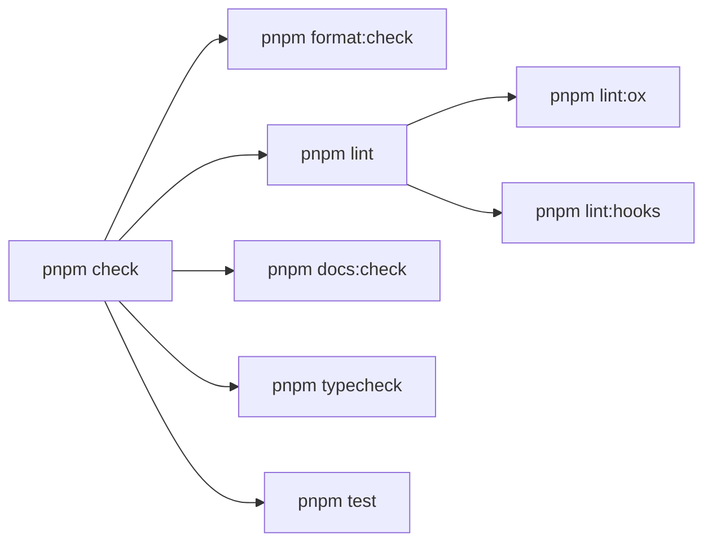
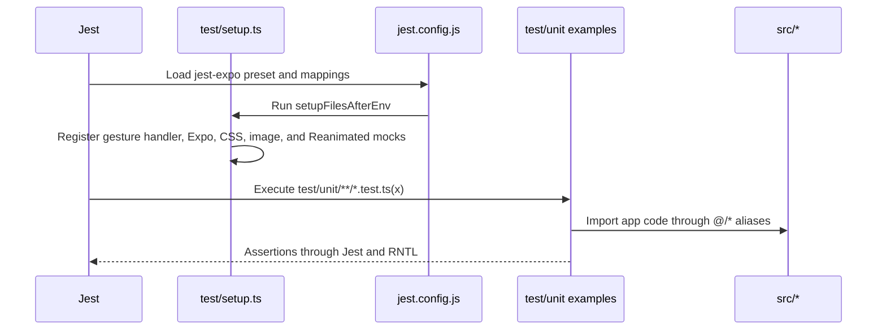
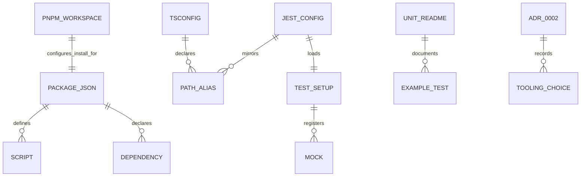

# Module: tooling

## Business Context

### Module Purpose

The `tooling` module is the local development, documentation, and quality-gate layer for this Expo workspace. It defines how dependencies are installed, how the app is started on each platform, how source is formatted and linted, how documentation drift is checked, how TypeScript is checked, and how Jest Expo unit tests run with React Native Testing Library.

The module is configuration-first. Its source of truth is the root package and tool config files, the shared Jest setup, executable unit-test examples, and [ADR 0002](_decisions/0002-toolchain.md) for the concise tradeoff record.

### Business Scenarios

- Install Expo-compatible dependencies with pnpm's hoisted node linker.
- Start Metro for iOS, Android, and web from stable package scripts.
- Run one local quality gate before handoff: format check, lint, documentation checks, typecheck, and unit tests.
- Use OXC for fast repository formatting and general linting.
- Enforce CRLF as the Windows-first working-tree line-ending policy.
- Keep the official React Hooks ESLint layer for React Compiler-era hook checks.
- Verify generated docs, registry-derived references, JSON indexes, local Markdown links, and stale documentation references.
- Validate strict TypeScript and project path aliases.
- Run Jest Expo tests with React Native Testing Library and shared Expo/native mocks.

### Domain Concepts

| Concept | Source | Purpose |
|---------|--------|---------|
| Package script contract | [package.json](../package.json) | Stable commands used by humans, agents, and docs. |
| pnpm hoisting | [pnpm-workspace.yaml](../pnpm-workspace.yaml) | Expo/RN-compatible `node_modules` layout. |
| OXC formatter | [.oxfmtrc.json](../.oxfmtrc.json) | Repository formatting behavior and ignore list. |
| CRLF policy | [.gitattributes](../.gitattributes), [.editorconfig](../.editorconfig), [.oxfmtrc.json](../.oxfmtrc.json) | Consistent Windows-first line endings. |
| Documentation gate | [scripts/check-docs.ps1](../scripts/check-docs.ps1) | Automated doc-system health and stale-reference checks. |
| OXC lint | [oxlint.json](../oxlint.json) | Fast correctness, suspicious, React, Jest, import, and TypeScript checks. |
| Official Hooks lint | [eslint.config.js](../eslint.config.js) | Authoritative `eslint-plugin-react-hooks` rules. |
| Strict TypeScript | [tsconfig.json](../tsconfig.json) | Expo base config, strict mode, and aliases. |
| Jest Expo test harness | [jest.config.js](../jest.config.js), [test/setup.ts](../test/setup.ts) | Unit test runtime, alias mapping, transforms, and mocks. |
| Test examples | [test/unit/README.md](../test/unit/README.md), [test/unit/examples](../test/unit/examples) | Copyable patterns for new tests. |

### Use Cases

1. **Run local verification**: `pnpm check` executes the full local gate in package-script order.
2. **Format or lint focused changes**: use `pnpm format`, `pnpm format:check`, `pnpm lint:ox`, `pnpm lint:hooks`, or `pnpm lint`.
3. **Check documentation health**: use `pnpm docs:check` for CRLF, generated-profile boundaries, JSON indexes, local Markdown links, and stale reference scans.
4. **Typecheck app and tests**: `pnpm typecheck` runs `tsc --noEmit` under strict mode with Expo generated types included.
5. **Add a unit test**: create `*.test.ts` or `*.test.tsx` under `test/unit/`, import through `@/*` or `@/assets/*`, and use shared mocks from `test/setup.ts`.
6. **Review tooling tradeoffs**: follow the current choices here, and use [ADR 0002](_decisions/0002-toolchain.md) plus ADR [0005](_decisions/0005-crlf-and-doc-automation.md) for rationale and revisit conditions.

## Technical Overview

### Module Type

Tooling, quality gate, and test infrastructure configuration for a single-package Expo application.

### Key Technologies

| Technology | Version / config | Role |
|------------|------------------|------|
| pnpm | `nodeLinker: hoisted` | Package manager and install layout. |
| Expo CLI | `expo start` scripts | Local dev server and platform launch commands. |
| OXC formatter | `oxfmt@0.46.0` | Fast formatting through `pnpm format` and `pnpm format:check`. |
| PowerShell docs gate | `scripts/check-docs.ps1` | Documentation and CRLF verification through `pnpm docs:check`. |
| OXC lint | `oxlint@1.61.0` | Fast general linting through `pnpm lint:ox`. |
| ESLint Hooks | `eslint@10.2.1`, `eslint-plugin-react-hooks@7.1.1`, `typescript-eslint@8.59.0` | Official React Hooks and React Compiler-era checks. |
| TypeScript | `typescript@~5.9.2` | Strict typecheck through `tsc --noEmit`. |
| Jest Expo | `jest@29.7.0`, `jest-expo@55.0.16` | Expo-compatible unit test runner. |
| React Native Testing Library | `@testing-library/react-native@13.3.3` | Component rendering and queries in tests. |

### Module Structure

```text
package.json                  Scripts, dependencies, dev dependencies, Expo Router entry
pnpm-workspace.yaml           pnpm hoisted linker configuration
tsconfig.json                 Strict TypeScript and path aliases
app.json                      Expo app metadata, plugins, typed routes, React Compiler
.gitattributes                Git CRLF working-tree policy
.editorconfig                 Editor CRLF and whitespace policy
.oxfmtrc.json                 OXC formatter settings and ignore list
oxlint.json                   OXC lint plugins, environments, categories, rules
eslint.config.js              Official React Hooks ESLint flat config
jest.config.js                Jest Expo preset, test globs, aliases, transforms
scripts/check-docs.ps1        Automated documentation system checks
test/setup.ts                 Shared Jest setup and Expo/native mocks
test/unit/README.md           Unit-test examples guide
test/unit/examples/*.test.*   Executable example tests
docs/_decisions/0002-toolchain.md   Toolchain decision record
```

## Components

### Package Management And Scripts

[package.json](../package.json) is the command surface for this module. The application entry point is `expo-router/entry`, and scripts wrap development, build delegation, formatting, linting, typechecking, testing, and the aggregate quality gate.

| Script | Command | Purpose |
|--------|---------|---------|
| `start` | `expo start` | Start Metro for interactive platform selection. |
| `android` | `expo start --android` | Start Metro and target Android. |
| `ios` | `expo start --ios` | Start Metro and target iOS. |
| `web` | `expo start --web` | Start Metro and target web. |
| `ios:ipa` | `eas build --platform ios --profile sideload --non-interactive` | Delegate unsigned iOS IPA build to EAS. |
| `ios:simulator` | `eas build --platform ios --profile development --non-interactive` | Delegate iOS simulator build to EAS. |
| `format` | `oxfmt --write .` | Format writable files according to OXC formatter config. |
| `format:check` | `oxfmt --check .` | Verify formatting without writing. |
| `lint:ox` | `oxlint -c oxlint.json --deny-warnings .` | Run OXC lint with warnings denied. |
| `lint:hooks` | `eslint --max-warnings 0 "src/**/*.{js,jsx,ts,tsx}" "test/**/*.{js,jsx,ts,tsx}"` | Run official React Hooks lint layer. |
| `lint` | `pnpm lint:ox && pnpm lint:hooks` | Run both lint engines in order. |
| `docs:check` | `pwsh -NoProfile -ExecutionPolicy Bypass -File ./scripts/check-docs.ps1` | Verify CRLF, generated docs, registry-derived references, JSON indexes, Markdown links, and stale references. |
| `typecheck` | `tsc --noEmit` | Run strict TypeScript checking. |
| `test` | `jest --runInBand` | Run unit tests serially. |
| `test:watch` | `jest --watch` | Run unit tests in watch mode. |
| `check` | `pnpm format:check && pnpm lint && pnpm docs:check && pnpm typecheck && pnpm test` | Full local quality gate. |

### pnpm Workspace Configuration

[pnpm-workspace.yaml](../pnpm-workspace.yaml) sets `nodeLinker: hoisted`. This keeps pnpm while presenting a dependency layout compatible with Expo and React Native tooling.

### Expo App Configuration

[app.json](../app.json) contributes tooling-relevant runtime configuration:

- `expo-router` is installed as a plugin and used as the package `main` entry.
- Typed routes are enabled through `experiments.typedRoutes: true`.
- React Compiler is enabled through `experiments.reactCompiler: true`.
- Web output is configured as static through `web.output: "static"`.
- The app uses Expo SDK 55 package versions from [package.json](../package.json).

### OXC Formatting

[.oxfmtrc.json](../.oxfmtrc.json) configures `oxfmt` with 2-space indentation, semicolons, single quotes, trailing commas, CRLF endings, final newlines, and a 100-column print width.

[.gitattributes](../.gitattributes) and [.editorconfig](../.editorconfig) define the same CRLF policy for Git and editors. ADR [0005](_decisions/0005-crlf-and-doc-automation.md) records the tradeoff.

The formatter intentionally ignores generated, external, or bulky paths such as `.agents/`, `.github/`, `.specify/`, `docs/`, `specs/`, `assets/`, native build folders, lockfiles, and Markdown files. The generated documentation in `docs/` is therefore not rewritten by `oxfmt`.

### OXC Linting

[oxlint.json](../oxlint.json) enables TypeScript, Unicorn, OXC, React, Jest, and import plugins. `correctness` and `suspicious` categories are errors, and `--deny-warnings` in `lint:ox` turns warnings into a failing gate.

Project-specific OXC rules include:

- `no-unused-vars: error`
- `react/rules-of-hooks: error`
- `react/exhaustive-deps: error`
- `jest/no-focused-tests: error`
- `jest/valid-expect: error`
- `jest/expect-expect: error`

### Official React Hooks ESLint Layer

[eslint.config.js](../eslint.config.js) keeps a focused ESLint flat config for `src/**/*.{js,jsx,ts,tsx}` and `test/**/*.{js,jsx,ts,tsx}`. It uses `typescript-eslint` as the parser and `eslint-plugin-react-hooks` flat recommended config, then explicitly sets `react-hooks/exhaustive-deps` to `error`.

This layer is intentionally separate from OXC. OXC provides fast general linting, while the official Hooks plugin remains the authoritative source for React Hooks and React Compiler-era checks. See [ADR 0002](_decisions/0002-toolchain.md) for the tradeoffs.

### Strict TypeScript And Aliases

[tsconfig.json](../tsconfig.json) extends `expo/tsconfig.base`, enables `strict: true`, and includes TypeScript, TSX, Expo generated types, and `expo-env.d.ts`.

| Alias | Target | Used by |
|-------|--------|---------|
| `@/*` | `./src/*` | Source and tests importing application code. |
| `@/assets/*` | `./assets/*` | Source and tests importing static assets. |

### Jest Expo And React Native Testing Library

[jest.config.js](../jest.config.js) uses the `jest-expo` preset and limits test discovery to `test/unit/**/*.test.ts` and `test/unit/**/*.test.tsx`. It mirrors the TypeScript path aliases for Jest and maps CSS-like imports to [test/style-mock.js](../test/style-mock.js).

The transform ignore pattern allows React Native, Expo, Expo namespace packages, React Navigation, Reanimated, and Worklets packages to be transformed correctly under Jest.

[test/setup.ts](../test/setup.ts) installs `react-native-gesture-handler/jestSetup` and provides shared mocks for:

- `@/global.css` as a virtual empty module.
- `expo-font`, returning loaded fonts and resolved async loading.
- `expo-image`, backed by React Native `Image` for tests.
- `react-native-reanimated`, using the package mock.

### Unit Test Examples

[test/unit/README.md](../test/unit/README.md) documents the copyable patterns in [test/unit/examples](../test/unit/examples):

| Example | Pattern | What it proves |
|---------|---------|----------------|
| [typescript-logic.test.ts](../test/unit/examples/typescript-logic.test.ts) | TypeScript logic | `@/*` aliases can import project constants and deterministic logic can be asserted. |
| [react-native-component.test.tsx](../test/unit/examples/react-native-component.test.tsx) | React Native rendering | RNTL can render project components and query visible text. |
| [alias-and-mocks.test.tsx](../test/unit/examples/alias-and-mocks.test.tsx) | Aliases and mocks | Project aliases, shared Expo mocks, and theme-dependent rendering work together. |

## Workflow

### Local Quality Gate



The gate is intentionally local and deterministic. It checks formatting first, then linting, then documentation system health, then TypeScript, then serial Jest tests.

### Documentation Gate

`pnpm docs:check` runs [scripts/check-docs.ps1](../scripts/check-docs.ps1). It validates CRLF line endings for tracked and newly added text files, verifies generated profile boundaries, checks registry-derived references against local source data, parses `docs/_index/*.json`, checks local Markdown links, and scans for known stale documentation paths or facts.

### Test Data Flow



### Adding A New Unit Test

1. Add a `*.test.ts` or `*.test.tsx` file under `test/unit/`.
2. Import app code through `@/*` and assets through `@/assets/*`.
3. Use `render` and `screen` from `@testing-library/react-native` for component tests.
4. Add shared native or Expo mocks to [test/setup.ts](../test/setup.ts) only when more than one test needs them.
5. Run `pnpm test`, then `pnpm check` before handoff.

## API Documentation

### Interface Type

The tooling module does not expose HTTP endpoints. Its public interface is the package-script API in [package.json](../package.json).

### Command Summary

| Command | Category | Writes files | Notes |
|---------|----------|--------------|-------|
| `pnpm install` | Install | Yes | Uses pnpm hoisted node linker. |
| `pnpm start` | Dev server | No | Starts Expo dev server. |
| `pnpm android` | Dev server | No | Starts Expo for Android. |
| `pnpm ios` | Dev server | No | Starts Expo for iOS. |
| `pnpm web` | Dev server | No | Starts Expo for web. |
| `pnpm format` | Formatting | Yes | Runs `oxfmt --write .`; docs are ignored by formatter config. |
| `pnpm format:check` | Formatting | No | Fails on formatting drift. |
| `pnpm lint:ox` | Lint | No | Fast OXC lint with warnings denied. |
| `pnpm lint:hooks` | Lint | No | Official React Hooks ESLint check. |
| `pnpm lint` | Lint | No | Runs both lint layers. |
| `pnpm docs:check` | Docs | No | Runs the automated documentation and CRLF gate. |
| `pnpm typecheck` | Types | No | Runs `tsc --noEmit`. |
| `pnpm test` | Tests | No | Runs Jest serially. |
| `pnpm test:watch` | Tests | No | Interactive watch mode. |
| `pnpm check` | Quality gate | No | Runs format check, lint, typecheck, and tests. |

### Authentication / Authorization

No local auth is required for format, lint, typecheck, or tests. EAS build scripts require an EAS environment outside this module's source-of-truth set.

### Error Handling

The aggregate scripts rely on shell short-circuiting. If `format:check`, either lint layer, `typecheck`, or `test` fails, `pnpm check` stops and returns the failing exit code.

## Data Model

### Entity Relationship Diagram



### Entities

#### Script

- **Purpose**: Stable command interface for local development and verification.
- **Storage**: `scripts` object in [package.json](../package.json).
- **Validation rule**: `pnpm check` must include `format:check`, `lint`, `typecheck`, and `test` in that order.

#### Formatter Configuration

- **Purpose**: Define repository formatting conventions, CRLF endings, and ignored generated/external paths.
- **Storage**: [.oxfmtrc.json](../.oxfmtrc.json).
- **Important fields**: `printWidth`, `tabWidth`, `singleQuote`, `semi`, `trailingComma`, `ignorePatterns`.

#### Lint Configuration

- **Purpose**: Split general lint from official hooks lint.
- **Storage**: [oxlint.json](../oxlint.json) and [eslint.config.js](../eslint.config.js).
- **Important fields**: OXC `plugins`, `categories`, `env`, `rules`; ESLint `files`, `parser`, `plugins`, `rules`.

#### TypeScript Configuration

- **Purpose**: Enforce strict type checking and import aliases.
- **Storage**: [tsconfig.json](../tsconfig.json).
- **Important fields**: `extends`, `compilerOptions.strict`, `compilerOptions.paths`, `include`.

#### Jest Configuration

- **Purpose**: Run Expo-compatible unit tests with alias and transform support.
- **Storage**: [jest.config.js](../jest.config.js).
- **Important fields**: `preset`, `setupFilesAfterEnv`, `testMatch`, `moduleNameMapper`, `transformIgnorePatterns`.

#### Shared Mock

- **Purpose**: Centralize native and Expo mocks shared by unit tests.
- **Storage**: [test/setup.ts](../test/setup.ts).
- **Mocks**: CSS import, `expo-font`, `expo-image`, `react-native-reanimated`; gesture handler setup import.

#### Documentation Gate

- **Purpose**: Verify documentation-system invariants before handoff.
- **Storage**: [scripts/check-docs.ps1](../scripts/check-docs.ps1).
- **Checks**: CRLF line endings, generated profile list, registry-derived references, JSON indexes, local Markdown links, and stale documentation references.

## Dependencies

### Internal Module Dependencies

| Dependency | Why it is needed |
|------------|------------------|
| [package.json](../package.json) | Script and dependency source of truth. |
| [pnpm-workspace.yaml](../pnpm-workspace.yaml) | Install layout source of truth. |
| [.gitattributes](../.gitattributes) | Git line-ending source of truth. |
| [.editorconfig](../.editorconfig) | Editor line-ending and whitespace source of truth. |
| [tsconfig.json](../tsconfig.json) | Strict TypeScript and alias source of truth. |
| [app.json](../app.json) | Expo typed routes, React Compiler, plugin, and web output flags. |
| [.oxfmtrc.json](../.oxfmtrc.json) | Formatter behavior. |
| [oxlint.json](../oxlint.json) | OXC lint behavior. |
| [eslint.config.js](../eslint.config.js) | Official Hooks lint behavior. |
| [jest.config.js](../jest.config.js) | Unit test runtime behavior. |
| [test/setup.ts](../test/setup.ts) | Shared test mocks. |
| [test/unit/README.md](../test/unit/README.md) | Test authoring guide. |
| [ADR 0002](_decisions/0002-toolchain.md) | Rationale and revisit conditions for the toolchain. |
| [ADR 0005](_decisions/0005-crlf-and-doc-automation.md) | Rationale and revisit conditions for CRLF and doc automation. |

### External Libraries

| Library | Version | Purpose |
|---------|---------|---------|
| `oxfmt` | `0.46.0` | OXC formatter. |
| `oxlint` | `1.61.0` | OXC lint engine. |
| `eslint` | `10.2.1` | Official Hooks lint runner. |
| `eslint-plugin-react-hooks` | `7.1.1` | React Hooks and React Compiler-era rules. |
| `typescript-eslint` | `8.59.0` | TypeScript parser for ESLint flat config. |
| `typescript` | `~5.9.2` | Strict compiler and `tsc --noEmit`. |
| `jest` | `29.7.0` | Unit test runner. |
| `jest-expo` | `55.0.16` | Expo Jest preset. |
| `@testing-library/react-native` | `13.3.3` | React Native component testing API. |
| `@types/jest` | `29.5.14` | Jest TypeScript declarations. |
| `@types/react` | `~19.2.2` | React TypeScript declarations. |

### Configuration Requirements

| Requirement | Required | Current value | Description |
|-------------|----------|---------------|-------------|
| pnpm hoisted linker | Yes | `nodeLinker: hoisted` | Required by current Expo/RN compatibility decision. |
| TypeScript strict mode | Yes | `strict: true` | Local type-safety gate. |
| OXC format check | Yes | `pnpm format:check` | First stage of `pnpm check`. |
| CRLF policy | Yes | `.gitattributes`, `.editorconfig`, `.oxfmtrc.json` | Windows-first working-tree line endings. |
| OXC lint | Yes | `pnpm lint:ox` | General lint stage. |
| Official Hooks lint | Yes | `pnpm lint:hooks` | React Hooks source of truth. |
| Documentation gate | Yes | `pnpm docs:check` | Generated docs, registry-derived references, links, indexes, stale references, and CRLF. |
| Jest Expo preset | Yes | `preset: jest-expo` | Expo-compatible test runtime. |
| Shared test setup | Yes | `test/setup.ts` | Native/Expo mock layer. |

## File Organization

### Component Distribution

| Component | Count | Files |
|-----------|-------|-------|
| Package/install configuration | 2 | `package.json`, `pnpm-workspace.yaml` |
| App/tooling runtime configuration | 1 | `app.json` |
| Line-ending configuration | 2 | `.gitattributes`, `.editorconfig` |
| Type configuration | 1 | `tsconfig.json` |
| Format configuration | 1 | `.oxfmtrc.json` |
| Lint configuration | 2 | `oxlint.json`, `eslint.config.js` |
| Test configuration/setup | 2 | `jest.config.js`, `test/setup.ts` |
| Documentation automation | 1 | `scripts/check-docs.ps1` |
| Test documentation/examples | 4 | `test/unit/README.md`, 3 example tests |
| Decision record | 1 | `docs/_decisions/0002-toolchain.md` |
| Generated outputs | 2 | `docs/tooling_profile.md`, `docs/_index/tooling_fileindex.json` |

### Key Files

1. **[package.json](../package.json)**: Script and dependency source of truth.
2. **[.gitattributes](../.gitattributes)** and **[.editorconfig](../.editorconfig)**: CRLF policy.
3. **[.oxfmtrc.json](../.oxfmtrc.json)**: OXC formatter settings and ignored paths.
4. **[scripts/check-docs.ps1](../scripts/check-docs.ps1)**: Documentation automation gate.
5. **[oxlint.json](../oxlint.json)**: OXC lint plugins, categories, environments, and rules.
6. **[eslint.config.js](../eslint.config.js)**: Official React Hooks ESLint layer.
7. **[tsconfig.json](../tsconfig.json)**: Strict TypeScript and aliases.
8. **[jest.config.js](../jest.config.js)**: Jest Expo preset, aliases, CSS mocks, and transform exceptions.
9. **[test/setup.ts](../test/setup.ts)**: Shared native/Expo mocks.
10. **[test/unit/README.md](../test/unit/README.md)**: Unit-test authoring guidance.
11. **[ADR 0002](_decisions/0002-toolchain.md)** and ADR **[0005](_decisions/0005-crlf-and-doc-automation.md)**: Rationale and revisit conditions.

## Quality Observations

### Strengths

- `pnpm check` is a single local gate and composes all required verification layers.
- `pnpm docs:check` turns doc-system rules into executable checks.
- OXC handles fast formatting and general linting, keeping the common path quick.
- The official React Hooks plugin remains in place for authoritative Hooks and React Compiler-era coverage.
- TypeScript and Jest share the same `@/*` and `@/assets/*` alias model.
- The test setup centralizes shared mocks so individual tests stay small and deterministic.

### Concerns

- Two lint engines mean hook-related rules can appear in both OXC and ESLint. Treat `eslint-plugin-react-hooks` as authoritative when the outputs differ.
- CRLF is optimized for this Windows-first workspace; revisit if Unix shell execution becomes a primary workflow.
- `oxfmt` ignores `docs/**` and Markdown files, so generated docs rely on generator quality rather than formatter enforcement.
- `jest --runInBand` favors deterministic Expo/RN behavior over parallel test throughput.

### Recommendations

- Keep new scripts represented in this profile when `package.json` changes.
- Keep `scripts/check-docs.ps1`, `docs/README.md`, generated profiles, and registry-derived references aligned when the doc system changes.
- Keep Jest aliases in sync with `tsconfig.json` aliases.
- Add shared mocks to `test/setup.ts` only after at least two tests need them.
- Revisit the OXC-only lint possibility only when OXC covers the official Hooks plugin's React Compiler-era rule set; the current rationale lives in [ADR 0002](_decisions/0002-toolchain.md).

## Testing

### Test Coverage

The current unit-test examples cover three tooling-critical paths:

- Pure TypeScript logic and alias imports through [typescript-logic.test.ts](../test/unit/examples/typescript-logic.test.ts).
- React Native component rendering with RNTL through [react-native-component.test.tsx](../test/unit/examples/react-native-component.test.tsx).
- Alias resolution plus shared Expo mocks through [alias-and-mocks.test.tsx](../test/unit/examples/alias-and-mocks.test.tsx).

### Key Test Scenarios

- `@/*` resolves to `src/*` in both TypeScript and Jest.
- `@/assets/*` is available to Jest through `moduleNameMapper`.
- CSS imports do not break tests.
- Expo font and image modules are mocked centrally.
- Reanimated uses its Jest mock.
- RNTL can render project components and query output.

## Performance Considerations

### Formatter And Lint Runtime

OXC is the fast path for formatting and general linting. ESLint is intentionally scoped to `src/` and `test/` files so the official Hooks layer stays focused.

### Test Runtime

Unit tests run with `jest --runInBand`. This is slower than parallel mode for large suites, but it avoids avoidable instability in React Native and Expo test environments while the suite is small.

### Scalability

As the test suite grows, keep examples deterministic and move repeated setup into [test/setup.ts](../test/setup.ts). If runtime becomes a bottleneck, evaluate parallel Jest execution only after confirming Expo/RN mocks remain stable.

---

**Generated**: 2026-04-28  
**Module Path**: root tooling configuration, `test/`, and `docs/_decisions/0002-toolchain.md`